---

---

# Deeplizard

一个教学网站。官方网址：https://deeplizard.com/learn/video/v5cngxo4mIg

# pytorch简介

张量是一个n维数组或者说一个m-D数组(d应该是轴)

下面的表给出了pytorch包及其对应的描述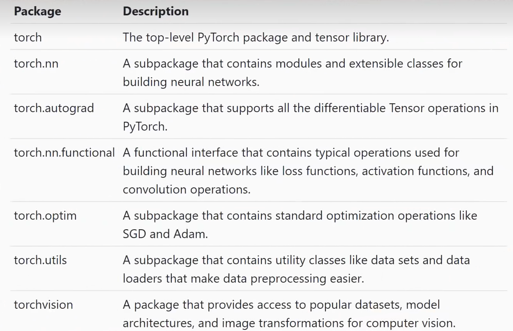

| 包名                    | 描述                                                         |
| ----------------------- | ------------------------------------------------------------ |
| **torch**               | 顶层 PyTorch 包和张量库                                      |
| **torch.nn**            | 包含用于构建神经网络的模块和可扩展类的子包                   |
| **torch.autograd**      | 支持 PyTorch 中所有可微张量运算的子包                        |
| **torch.nn.functional** | 包含构建神经网络常用操作（如损失函数、激活函数、卷积运算）的函数接口 |
| **torch.optim**         | 包含标准优化操作（如 SGD 和 Adam）的子包                     |
| **torch.utils**         | 包含数据集和数据加载器等工具类，简化数据预处理的子包         |
| **torchvision**         | 提供计算机视觉领域流行数据集、模型架构和图像变换的包         |

| 场景           | 使用的包                  |
| -------------- | ------------------------- |
| 定义网络结构   | `torch.nn`                |
| 前向传播操作   | `torch.nn.functional`     |
| 反向传播求梯度 | `torch.autograd`          |
| 更新权重参数   | `torch.optim`             |
| 加载训练数据   | `torch.utils.data`        |
| 图像相关任务   | `torchvision`             |
| 文本相关任务   | `torchtext`               |
| 语音相关任务   | `torchaudio`              |
| 部署/加速模型  | `torch.jit`, `torch.onnx` |


当使用pytorch建立神经网络时，非常接近从零开始编写神经网络，作为一个神经网络框架，pytorch足够简单


# 初识CUDA

GPU是一种处理特殊计算的处理器，cpu是擅长处理一般计算的处理器

gpu擅长并行计算(Parallel computing)


**gpu为什么能加速神经网络的计算？**

神经网络的计算是易平行任务，能轻易分解成一组独立的小任务，能进行相互独立的运算(并行计算)，而gpu有成千上万的核可以进行并行计算

以神经网络的卷积计算为例

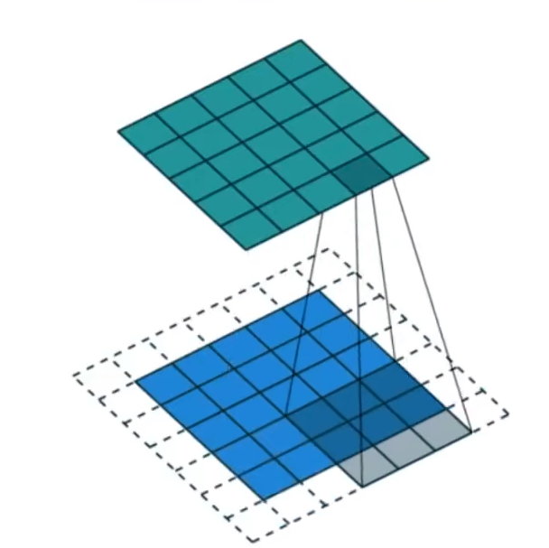

卷积运算的过程：卷积核(3x3)在下面的蓝色输入通道上滑动，每移动一次就计算出一个值，这个值对应的上面绿色的输出通道的一个值，这就是卷积运算的输出。

在卷积运算的过程中，卷积核在每个位置的计算都独立于其他位置的计算，没有任何一个计算依赖其他计算的结果，因此，所有这些独立计算都可以在gpu上并行进行(同时计算)而不需要相继计算每个位置卷积，然后，只需要并行计算一次后整个输出通道就能产生了，**因此利用并行计算的思想和gpu就能加速卷积计算**，**这就是cuda发挥作用的地方**


**cuda是什么？**

gpu是支持并行计算的硬件，**cuda是与gpu配对的给开发者提供api的软件层**

有了gpu后，就能在英伟达官网下载Cuda工具包，在这个工具包中，有一些专门的库，比如**Cudnn**就是其中的神经网络库

不过现在Cudnn一开始就由pytorch自带了，用pytorch时不用额外的下载，只需要有gpu就能用pytorch来驱动cuda，不需要直接使用cuda api。**但是如果想要研究pytorch核心代码或者编写pytorch扩展，那么就需要知道如何直接使用cuda**，**因为底层仍然是c和c++，如果想要进一步加快处理速度以及提升性能，那么就要专门去研究cuda**


使用pytorch驱动cuda

下面的代码创建了一个张量并输出，**以这种方式创建的张量在默认情况下是在cpu上运行，因此使用这个张量对象的任何操作都将在cpu上执行**

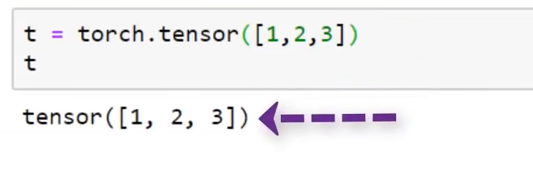

如果想把这个张量移到gpu上，只需写t.cuda() ，**在一个张量上调用cuda函数会返回相同的张量，但是是在gpu上**

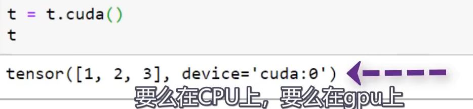


**为什么不直接在gpu上运行每一个计算？**

对于适用于并行计算的**大型任务**，用gpu会比cpu快很多，但是如果把小型的计算任务转移到gpu上，计算速度可能没有cpu快，所以对于简单的任务用cpu会更好


下面这篇论文深入研究了gpu编程和cuda


# 张量

张量是神经网络使用的主要的数据结构

## 初识张量

**不同的研究领域中常用不同名字的术语表达相同的概念**

比如下图的数字、数组、二维数组就是计算机科学中的术语

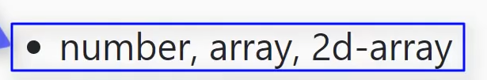

下图的标量、向量和矩阵就是数学中的术语


可以把上面的一系列术语分为三组，每组都表示不同领域中的同一概念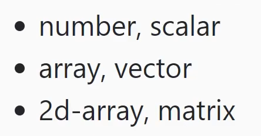


**索引：**

对于上面提到的三个数据结构，想要引用(得到)它们的某一个特定的元素，分别需要0，1，2个索引

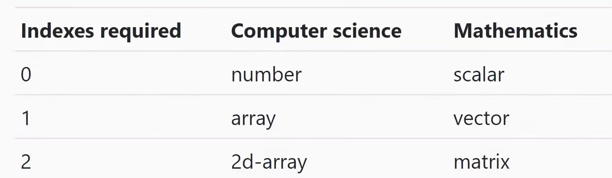

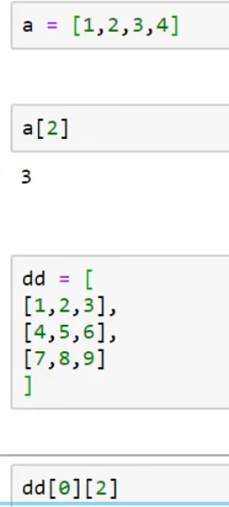


然而，当一个数据结构需要超过两个索引来访问特定的元素时，就不用给予该数据结构一个特定的名称，而是对它使用更通用的语言

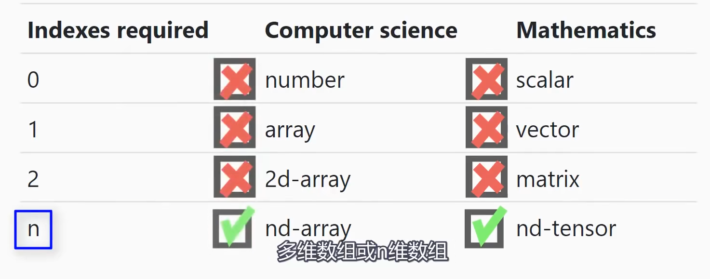

在数学领域中，把它称为(n维)张量，n表示在这个数据结构中想要访问特定元素所需要的索引数量

在计算机领域中，称为n维数组(多维数组)

因此在深度学习和神经网络编程中，张量就是多维数组，张量更加泛化地表示这些数据结构，比如0维张量就是标量、一维张量就是向量


**区分张量维数和向量维数的不同**

张量的维数，仅仅表示访问特定元素需要的索引数量(学到目前为止)，张量的维数并没有告诉我们张量中有多少分量

向量的维数，应该是一个向量所含元素的数量

比如在一个三维欧几里得空间中有一个三维向量，那么可以得该向量有三个元素(三个分量)


但是一个三维张量的分量可以多于三个，比如这里的二维张量就有九个分量

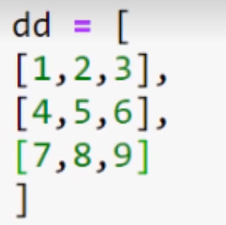


**索引为我们提供了一种具体的方式来理解与张量相关的概念。**


## 张量的阶、轴和形状

秩、轴和形状是张量的三个基本属性，也是我们在深度学习中**最为关注的张量属性**，这些概念是逐步建立的，从秩开始，再到轴，最后到形状。**它们本质上都与索引概念密切相关**

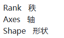


### **张量的阶**

是指张量维度的数量(张量的维数)

假设有人告诉我们，我们有一个阶为 2 的张量。这意味着以下所有情况：

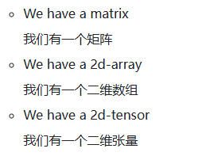

注意：在这里引入“阶”这个术语，因为在深度学习中，通常用它来表示给定张量中维度的数量，**这同样只是在不同的科学领域使用不同术语表示相同概念的例子**，阶/多维数组/张量 表示同一个概念。因此不要被这些术语搞混

**注意**：张量的阶和线性代数中所学的矩阵的秩不是同一概念，只是不幸的用了同一个英文单词rank，张量的阶表示张量的轴数(维度数)，而矩阵的秩表示矩阵中线性无关的行/列的最大数目。为了不混淆概念，还是称作张量的阶更好


张量的阶告诉我们需要多少个**索引**才能访问（引用）张量数据结构中包含的特定数据元素。


### **张量的轴**

张量的轴是张量的一个特定维度，张量有n个维度，就有n个轴，**即轴的数量就是维度的数量/阶数**


**轴的长度**

每个轴的长度告诉我们沿该轴可用的索引数量。


假设我们有一个名为 `t` 的张量，并且我们知道第一个轴的长度为三，而第二个轴的长度为四

由于第一个轴的长度为三，这意味着我们可以沿第一个轴索引三个位置

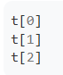

由于第二个轴的长度为四，我们可以沿着第二个轴索引四个位置。这对于第一个轴的每个索引都是可能的，因此有

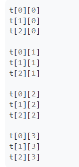

对于t，可以想象在一个二维平面上， 有两个轴x轴和y轴，x轴长度为3，y轴长度为4,，可以如此形象的理解轴的概念。


**张量轴示例**

虑之前的同一个张量 `dd` ：

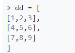

沿着第一个轴的每个元素，都是一个数组：

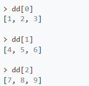

沿着第二个轴的每个元素是一个数字：

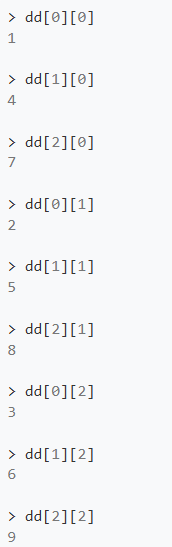

如何理解？

想象在二维平面上有x轴和y轴，然后一共有九个点在平面上，分别对应着9个数字，然后沿着第一个轴，就是沿着x轴，能直观的看到x轴的每个元素都是一个数组(一维数组)，而上面说的沿着第二个轴的意思是  在第一个轴某个元素的基础上沿着第二个轴看，那每个元素都是一个数字


对于张量，**最后一个轴**的元素总是数字。**其他每个轴将包含 n 维数组，一个n维张量的第0轴会包含x和(n-1)维数组，第1轴会包含y个(n-2)维数组 （这里的x和y是对应轴的长度，只有得知了张量的形状之后才能知道x和y的值，也要注意和向量的维数进行区分）**

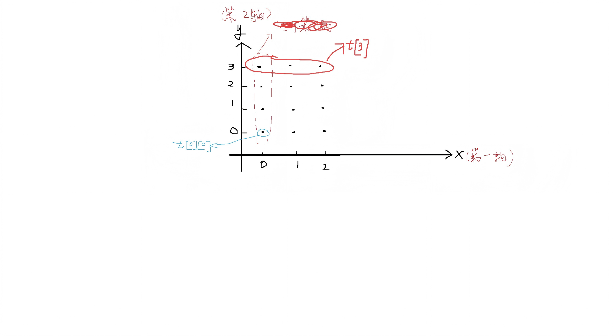

### 张量的形状

张量的秩告诉我们张量有多少个轴，而这些轴的长度引出了一个非常重要的概念，即张量的形状。

**张量的形状由每个轴的长度决定**，因此如果我们知道给定张量的形状，就能知道每个轴的长度，这也告诉我们每个轴上有多少个索引可用。


**张量的形状给出了张量每个轴的长度**


为了处理这个张量的形状，可以创建一个 `torch.Tensor` 对象：

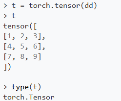

查询张量的shape，**在 PyTorch 中，张量的 size 和 shape 是同一回事。**

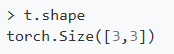

t张量的形状是3x3，它的形状告诉了我们两个东西：

​	1.它是一个二维张量/这个张量有两个轴

​	2.每个轴的长度都是3。**这意味着我们在每个轴上都有三个可用的索引。**


**张量的形状很重要**

1 形状让我们能够从概念上思考，甚至可视化一个张量。高阶张量会变得更加抽象，而形状为我们提供了一个具体的参考来思考。

2 形状同样包含了关于轴、秩以及索引的所有相关信息。


## CNN 张量形状解析

CNN 输入的形状通常为四维，即输入是四维张量

分析这个张量应从最后一个轴开始，因为最后一个轴上是实际的数字或数据值所在的位置。**数据值就是像素值**


H和W是高度和宽度，图像的高度和宽度表示在最后两个轴上，高度和宽度也是实际数据的索引

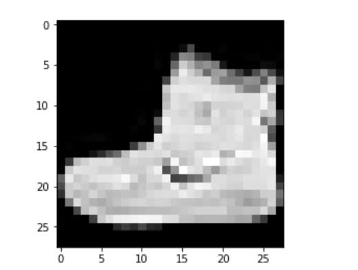

C表示颜色通道，RGB图像有三个通道，灰度图有1个通道。**这个颜色通道的解释仅适用于输入张量，因为输出张量的这个维度就不表示颜色通道而是特征图了，即在张量通过卷积层后，颜色通道这个轴的解释会发生变化。**

**在访问数据时，我们需要三个索引。我们选择一个颜色通道、一个高度和一个宽度，以得到一个特定的像素值。**


第一个轴是图像批次Batch size，表示批次大小。神经网络中，**通常处理的是一批样本，而不是单个样本，因此这个轴的长度告诉我们批次中包含多少个样本。**


**注意**：在阅读 API 文档和学术论文时，常常会看到 `B` 被 `N` 替换。 `N` 也代表批次中的样本数量，和B意思相同。


**不同库的网络输入排列不同**

pytorch库是NCHW


而 TensorFlow 和 Keras 默认使用 `NHWC` （可以进行配置）。最终，选择使用哪种方式主要取决于性能。一些库和算法更适合其中某一种排列方式。


**输出通道与特征图**

下面解释输入的图像张量经过卷积层转换后，颜色通道轴的解释是如何变化的。

假设一个 `[1, 1, 28, 28]` 的图像张量传递给 CNN，并经过第一个卷积层，结果张量的形状和底层数据将被卷积操作改变。

**卷积会改变高度和宽度维度，以及通道数量**。输出张量的**通道的数量根据卷积层中使用的过滤器数量而变化。**

**假设有三个卷积滤波器，则卷积层将产生三个通道输出。这些通道是卷积层的输出，因此被称为输出通道，而不是颜色通道。**


输出张量的形状变成了`[1, 3, 28, 28]`,通道数量变为了3，这个修改后通道不再叫作颜色通道，而叫作**特征图**。这些所谓的特征图是通过输入颜色通道和卷积滤波器进行卷积操作后产生的输出。


之所以使用“特征”这个词，是因为这些输出代表了图像中的**特定特征**，比如边缘等(**不同的卷积核能提取不同的特征，比如有的卷积核能提取边缘特征**)。这些映射随着网络在训练过程中不断学习而出现，并且随着我们进入网络的更深层次，变得越来越复杂。

**总结：特征图是通过卷积生成的输出通道。**


# pytorch中的张量

在编程神经网络时，数据预处理通常是整体过程中的第一步之一，数据预处理的一个目标是将原始输入数据转换为张量形式。


## **torch.Tensor()和torch.tensor()的区别**

| 特性             | `torch.Tensor()`               | `torch.tensor()`         |
| ---------------- | ------------------------------ | ------------------------ |
| **默认数据类型** | `torch.float32`（单精度浮点）  | **根据输入数据自动推断** |
| **是否推荐**     | ⚠️ 不推荐（易混淆）             | ✅ 推荐                   |
| **功能定位**     | Tensor类的构造函数，创建空张量 | 工厂函数，从数据创建张量 |
| **接收数据**     | 主要接收**维度**（shape）      | 主要接收**数据**（data） |

1、关键区别：默认类型不同

```python
import torch

# torch.Tensor() - 默认 float32，即使输入整数也会转为浮点
a = torch.Tensor([1, 2, 3])
print(a)          # tensor([1., 2., 3.])  ← 注意有小数点
print(a.dtype)    # torch.float32

# torch.tensor() - 根据输入自动推断类型
b = torch.tensor([1, 2, 3])
print(b)          # tensor([1, 2, 3])     ← 保持整数
print(b.dtype)    # torch.int64（或 torch.LongTensor）

# 显式指定类型
c = torch.tensor([1, 2, 3], dtype=torch.float32)
print(c.dtype)    # torch.float32
```

torch.tensor除了默认自动推断类型，还能显式指定类型

```python
c = torch.tensor([1, 2, 3], dtype=torch.float32)
print(c.dtype)    # torch.float32
```


2  创建空张量 vs 从数据创建

```python
# torch.Tensor() - 更像"分配内存"，接收的是形状
x = torch.Tensor(2, 3)      # 创建 2x3 的**未初始化**张量（值是随机的！）
print(x.shape)              # torch.Size([2, 3])

# torch.tensor() - 从具体数据创建
y = torch.tensor([[1, 2, 3], [4, 5, 6]])  # 从嵌套列表创建
print(y)                    # tensor([[1, 2, 3],
                            #         [4, 5, 6]])
```

torch.Tensor创建的是一个未初始化的空张量

**几乎总是使用 `torch.tensor()` 而不是 `torch.Tensor()`，前者语义更清晰，类型推断更智能，是 PyTorch 官方推荐的方式。**

## **什么是工厂函数？**

简单来说它是一个独立的函数，功能是接受参数输入并**返回特定类型对象**，**返回值是一个特定的对象**

**工厂函数**是一种用于**创建对象的设计模式**，指的是**返回对象实例的函数或方法**，而不是通过直接调用类构造函数来创建对象。

| 特点             | 说明                                                         |
| ---------------- | ------------------------------------------------------------ |
| **自动推断类型** | 根据输入数据自动选择 `dtype`（如 `int` → `torch.int64`，`float` → `torch.float32`） |
| **数据拷贝**     | 总是复制数据，不共享内存                                     |
| **灵活创建**     | 可以从列表、NumPy 数组等多种来源创建                         |


以下pytorch的函数都是工厂函数

```python
# 创建特定类型的张量
torch.zeros(2, 3)      # 全零张量
torch.ones(2, 3)       # 全一张量
torch.randn(2, 3)      # 随机正态分布
torch.arange(0, 10)    # 类似 range
torch.linspace(0, 1, 5) # 等间隔序列
torch.eye(2) #返回一个单位张量

# 从现有数据创建（不拷贝，共享内存）
torch.from_numpy(np_array)  # 从 numpy 创建
```


torch.tensor()函数简化版的实现原理(以此更加了解1工厂函数)以及Tensor()的实现

```python
import numpy as np

# ========== 1. 底层 Tensor 类（类似 torch.Tensor）==========

class Tensor:
    """底层的张量类，通过 __init__ 创建"""
    def __init__(self, data, dtype=None, device='cpu'):
        # 简单的 numpy 存储模拟
        self.data = np.array(data, dtype=self._map_dtype(dtype))
        self.dtype = dtype
        self.device = device
        print(f"Tensor.__init__ 被调用: dtype={self.dtype}")
    
    def _map_dtype(self, dtype):
        # 简化版类型映射
        dtype_map = {
            'float32': np.float32,
            'int64': np.int64,
            None: None,  # 让 numpy 自动推断
        }
        return dtype_map.get(dtype, None)


# ========== 2. 工厂函数（类似 torch.tensor）==========

def tensor(data, dtype=None, device='cpu', requires_grad=False):
    """
    工厂函数 - 封装创建逻辑，返回 Tensor 实例
    """
    # 1. 自动推断 dtype（如果用户没指定）
    if dtype is None:
        dtype = _infer_dtype(data)
        print(f"工厂函数推断 dtype: {dtype}")
    
    # 2. 数据预处理（如从 list 转换）
    processed_data = _prepare_data(data)
    
    # 3. 调用底层类创建对象
    return Tensor(processed_data, dtype=dtype, device=device)


def _infer_dtype(data):
    """自动推断数据类型"""
    if isinstance(data, (list, tuple)) and len(data) > 0:
        # 检查第一个元素
        elem = data[0]
        if isinstance(elem, (int, np.integer)):
            return 'int64'
        elif isinstance(elem, (float, np.floating)):
            return 'float32'
    return 'float32'  # 默认


def _prepare_data(data):
    """数据预处理"""
    # 深拷贝，确保不共享内存
    return np.array(data).tolist()


# ========== 测试对比 ==========

print("=" * 40)
print("直接用 Tensor 类:")
t1 = Tensor([1, 2, 3])  # dtype=None, numpy 自动处理

print("\n" + "=" * 40)
print("用工厂函数 tensor():")
t2 = tensor([1, 2, 3])  # 自动推断为 int64
```


**更真实的工厂模式：返回不同子类**

```python
class CPUTensor(Tensor):
    pass

class GPUTensor(Tensor):
    pass

def tensor(data, dtype=None, device='cpu'):
    """根据参数返回不同子类的工厂函数"""
    # ... 预处理和推断 ...
    
    if device == 'cpu':
        return CPUTensor(data, dtype, device)
    else:
        return GPUTensor(data, dtype, device)  # 返回不同类！
```

要注意torch.tensor()和torch.Tensor 并非完全无关，t**orch.tensor()会在内部创建 Tensor 实例(内部调用类构造函数)**，因为最终要调用Tensor 类创建对象作为返回值


## 张量的属性

### `torch.device`：

**指定张量数据分配的设备（CPU 或 GPU）。这决定了给定张量的计算将在何处执行。**PyTorch 支持使用多个设备，可以通过如下方式使用索引指定设备：

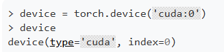

### `torch.dtype`

对于一个张量，包含统一类型的数据（ `dtype` ）

### `torch.layout`

指定了张量在内存中的存储方式。


## 使用数据创建张量对象

主要有**四种方式**，它们都接受某种形式的**数据**，并返回一个 `torch.Tensor` 类的实例

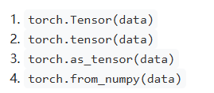

输入数据的常见选择是numpy数组(numpy.ndarray)

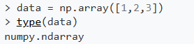

将它输入给上面的函数，可见后三个都是工厂函数，能自动推断类型

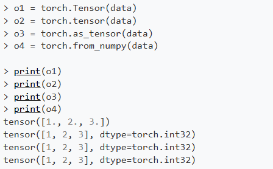


**这四种方式的区别，以及哪个好？**

`torch.Tensor()`是Tensor类的构造函数

它构造函数在构建张量时使用了默认的 `dtype`，即torch.float32类型

使用 `torch.Tensor()` 时，我们无法将 `dtype` 传递给构造函数。这就是它的缺陷，也是选择torch.tensor()的原因之一

剩余三个都是工厂函数

它有自动类型推断，就是根据输入参数的数据类型来推断所创建的张量的类型


**内存上的区别**

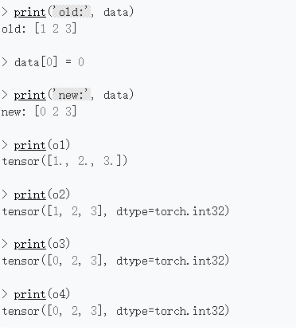

`torch.Tensor()` 和 `torch.tensor()` 会复制它们的输入数据，因此改变原始数据不会影响之前调用的结果

而 `torch.as_tensor()` 和 `torch.from_numpy()` 则会将它们的输入数据与原始输入对象在**内存中共享**。共享数据比复制数据更高效且占用更少的内存

`torch.from_numpy()` 如此设计的目的是为了和numpy用户无缝衔接，因为numpy的数组操作就是共享内存的

**那么对于`torch.as_tensor()` 和 `torch.from_numpy()`这两个共享内存的函数还有什么不同？**

`torch.from_numpy()` 函数只接受 `numpy.ndarray` ，而 `torch.as_tensor()` 函数接受多种类数组对象，包括其他 PyTorch 张量。因此，在内存共享方面， `torch.as_tensor()` 是最优选择。


**在 PyTorch 中创建张量的最佳选择**

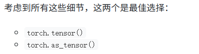

`torch.tensor()` 调用是常用的调用，而 `torch.as_tensor()` 应该在调优代码性能时使用。

注意事项：

​	1.由于 `numpy.ndarray` 对象分配在 CPU 上，当使用 GPU 时， `as_tensor()` 函数必须将数据从 CPU 复制到 GPU。
​	2.`as_tensor()` 的内存共享无法与像列表这样的内置 Python 数据结构一起使用。

​	3.`as_tensor()` 调用需要开发者了解共享功能，谨慎使用避免误操作

​	4.如果 `numpy.ndarray` 对象和张量对象之间有大量的反复操作， `as_tensor()` 的性能提升会更显著。然而，如果只是单一的加载操作，从性能角度来看，影响应该不大。


# 张量的reshape操作

操作的整体框架，分为四个主要类别

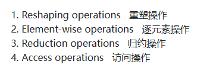

假设有以下的张量：

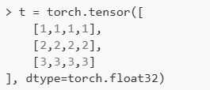

有两种获取张量形状的方法

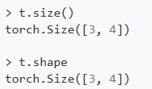

张量的阶数就是张量形状的长度

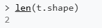

还可以**推断张量中包含的元素数量**。在 PyTorch 中，有一个专门的函数用于此操作

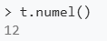


**reshape的目的是在不改变数据内容的前提下改变张量的形状**，因此使用reshape函数时，需要满足以下条件

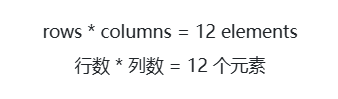


**通过压缩(squeezing)和解压(unsqueezing)改变形状**

另一种改变张量形状的方法是通过压缩（squeezing）和解压（unsqueezing）张量。分别对应torch.squeeze()和torch.unsqueeze()函数

下图是这两个函数的作用

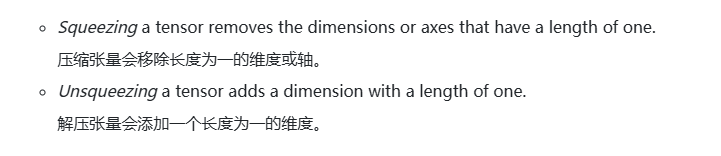

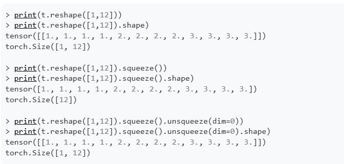

unsqueeze操作时，若原张量不存在这个轴，就创造这个轴，若原张量已经存在这个轴，那就在该轴前面创造一个新的轴，比如dim=0就表示在现有的第0轴前创一个轴作为第0轴，原第0轴变为第一轴


压缩张量常用于**展平一个张量**(**Flatten a tensor**)

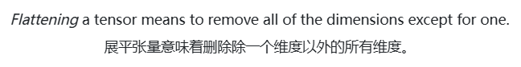

**意思是去除所有维度，只留下一个包含所有数据的一维张量（向量/一维数组）**

展平过程的简单演示：

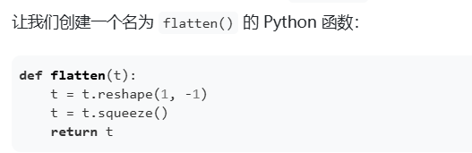

这里reshape成一个二维张量，第一个参数表示第一个轴长度为1，因为参数t可以是任意张量，所以将 `-1` 作为第二个参数(最后一个参数)传递给 `reshape()` 函数。它表示**reshape函数会自动推断第二个轴的长度**

执行t.squeeze()函数压缩之后，第一个轴（axis-0）被移除，我们得到所需的结果——一个长度为 `12` 的一维数组。

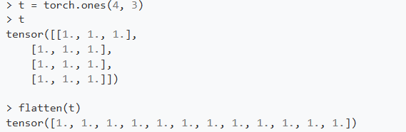


**张量的拼接操作**

使用 `cat()` 函数来合并张量，得到的张量形状将取决于两个输入张量的形状

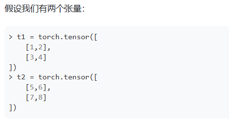

按行(轴0)拼接(注意输入的两个张量要用小括号框起来)，轴0的内容是数组，因此拼接的是数组

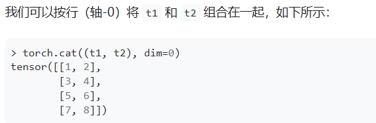

按列（轴1）拼接，因为在这里轴1是最后一个轴，所以把数字拼接

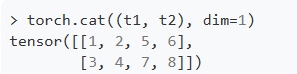

拼接张量后，会增加元素的数量，导致张量轴的长度发生变化

**注意拼接的轴只会导致该轴的长度发生变化，而其他轴的长度不会发生变化**

每当我们改变张量的形状时，我们就说是在重塑(reshape)张量。


# 针对卷积神经网络的图像输入批次的展平操作

张量扁平化操作是卷积神经网络中常见的操作。这是因为传递给全连接层的卷积层输出必须先被扁平化，**才能被全连接层接受输入。**

要展平一个张量，至少需要两个轴，下图是一个数字8图像被展平的过程，每一行被分别单独抽出，然后上一行和下一行首尾相接，构成一个一维张量


## 展平张量的特定轴

因为在CNN中，一般以批次来处理张量，下图是把三个(4,4)形状的张量用torch.stack()方法拼接成一个大张量，该张量的第0轴表示批次

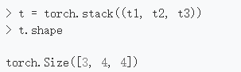


对于CNN，卷积神经网络需要明确的颜色通道轴，因此通过reshape这个张量来添加一个轴。

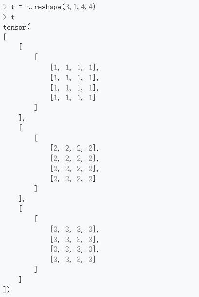

现在就能用一个张量来表示一个批次的图片了，比如t[0]可以表示第一张图片(灰度图)

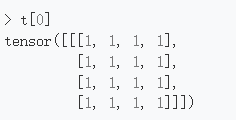

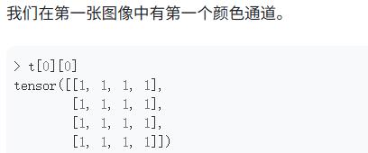

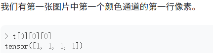

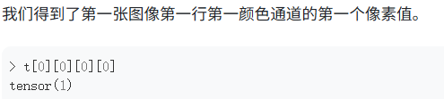


## 对批处理张量进行展开

记住，整个批次是一个将传递给 CNN 的单一张量，所以我们不想展平整个批次(即不需要展平第0轴)。我们只想展平批次张量中的图像张量。


如果想把张量所有轴都展平，由多种方法

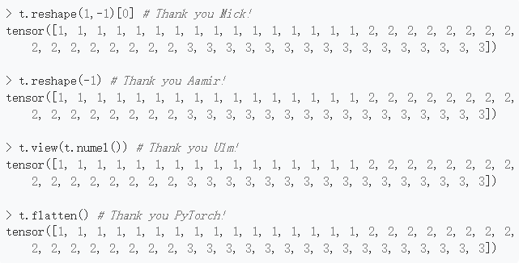

其中torch.flatten()方法是最好的，能直接把张量展平成一维

但是能看到，如果把整个批次的所有图像都展平成一维，输入神经网络的效果就不好。**因为我们需要对批次张量中的每张图像分别进行预测，而现在我们得到的只是一个混乱的展平数据。**

所以解决方案是：在保持批次轴(第0轴)不变的情况下对每个图像进行展平。

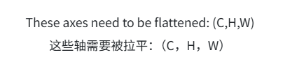

## 展平张量的特定轴

通过`torch.flatten()` 方法完成

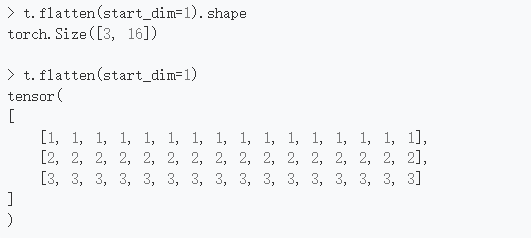

`start_dim` 参数的含义是，从指定的轴开始展平操作，这里表示把第1轴(1是索引)以及后面的所有轴都进行展平操作，而不会对第0轴展平，因此批次的轴仍不变。

可以看到张量变成了一个二阶张量，其中包含三个单色通道的图像，**这些图像已经被展平为 `16` 个像素。本质上就是把每个图像的像素展开排列在一个一维张量上，就和开头图片所示的那样**


展平一个rgb图像


构建后的图像张量可如下图形象表示，变成三个2x2的图像构成的张量


对颜色通道展平后


# PyTorch 的广播与张量的逐元素操作

这次将学习逐元素操作


**两个张量必须具有相同的形状，才能对它们执行逐元素操作。**


## 加减乘除都是逐元素操作

**张量间的加减乘除都是逐元素操作**，对应位置的每一对元素相加/减/乘/除，生成一个具有相同形状的新张量。


## **使用标量值进行算术操作同样也是逐元素操作**。

有两种方法可以做到这一点：

第一种：使用符号化操作


第二种：用张量内置的对象方法


问题：标量值是 0 阶张量，这意味着它们没有形状，而我们的张量 `t1` 是一个形状为 `2 x 2` 的 2 阶张量。**可见它们的形状并不相同，那么是如何实现逐元素计算的呢？**


**解决方案：张量广播**

广播描述了在元素级操作中，**具有不同形状的张量是如何被处理的。**


通过广播，能使低阶张量的形状和高阶张量的形状对齐(两个张量的形状相等)


标量被广播以后变成了2x2的张量


回顾原代码


可以用`np.broadcast_to()`函数查看低阶张量广播到高阶张量后的形状

另一个例子


t2广播之后复制了第0轴长度变为2


**什么时候实际使用广播？**

**我们通常在预处理数据时，尤其是在归一化过程中，需要使用广播。**


## 比较操作是逐元素进行的

对于两个张量之间的给定比较操作，将返回一个形状相同的新张量，其中每个元素的值要么是 `1`，要么是 `0`。

注意：PyTorch不同版本的比较操作结果不一样


以下示例显示了 PyTorch 版本 1.2.0 及更高版本的输出。

假设我们有以下张量：


有以下的比较操作


从广播的角度思考这些操作，拿最后一个举例，最后一个t.le(7)实际上是：把标量7广播成t的形状然后逐元素比较


即等价于


## 使用函数进行逐元素操作


## 一些术语

还有一些其他方式可以称呼逐元素操作，以下说法都是同一个意思


## 广播机制详解

回顾广播的定义


两个张量进行**逐元素计算**的时候，当两张量形状相同时，正常计算，不会发生广播，当张量的形状不同时，广播才会起作用。

**注意：只在逐元素操作才有广播的概念，因为只有两个张量的形状相同时才能进行逐元素操作，而使两个张量形状相同的工具就是广播**

### 相同阶，不同形状张量的逐元素操作


一个形状为 (1, 3) 的张量，另一个形状为 (3, 1) 的张量。那么，这里就要派上广播（broadcasting）的作用了。

相加的结果是一个(3,3)的张量


### 广播的工作原理。

广播的目标是让张量具有相同的形状，以便对它们执行逐元素操作。


**步骤 1：确定张量是否兼容**

这一步的目的是查看我们尝试执行的操作在给定的张量之间是否可行。根据张量的原始形状，可能没有办法将它们重新形状以强制它们兼容；如果我们不能做到这一点，那么就不能使用广播。


判断是否可以使用广播的规则：

最后一个维度开始，向前比较两个张量每个维度的形状。我们的目标是确定两个张量的形状中**每个维度是否兼容。**

**当且仅当**下面的**一个条件成立**时，维度是兼容的：

​	1.它们彼此相等(对应轴的长度相等)。

​	2.其中一个是 1(其中一个维度的形状是1)。


在上面的示例中，分别有(1,3)和(3,1)两个张量，现在先比较最后一个维度，得到的是3和1，现在来比较：


所以它们最后的维度是兼容的

再从最后维度往前推，下一维分别是1和3，同理也兼容，因此这两个张量的每个维度都是兼容的，可以对他们进行广播


注意：只要两个张量至少有一个维度不兼容，那么将无法对他们进行广播，即无法对他们进行逐元素运算。


**步骤 2：确定结果张量的形状**

同样从最后一个维度开始比较，哪个张量的维度大，那该维度会成为结果张量的这个维度的形状，比如(3,1)和(1,3)，先比较最后一个维度的1和3，那么3会成为结果张量形状的最后一个维度

以此类推，结果张量的维度就为(3,3)

**步骤 3：开始广播**

确定结果张量的形状后，将对两个张量的形状为1的维度进行**复制**，直到达到所需的形状为止

比如(1,3)张量将复制第一个维度变成(3,3)，即广播到(3,3)


(3,1)的张量广播到(3,3)，复制了第二个维度


广播之后就能进行逐元素运算


### 不同阶张量的逐元素操作

以标量和二维张量相乘为例


**确定张量是否兼容**

对于标量，它的维度是0维，被认为是缺失了维度，因此只需将较低秩张量中缺失的维度替换为 1。现在它的形状是 (1,1)。**这可以理解为pytorch进行广播的时候会自动把缺失的维度用形状1来填补**

显然(1,3)和(1,1)兼容，

于是将对(1,1)张量进行广播，广播成(1,3)张量


下一个例子：

如果我们想要对这个形状为 (1, 2, 3) 的三阶张量以及这个形状为 (3, 3) 的二阶张量进行求和，会怎样？

这两个张量不兼容，**因为从最后一个维度开始往前进行比较**，倒数第二个维度的形状分别是2和3，它们不相等，而且都不是 1，不满足步骤一中的任何一个条件，因此两个张量无法广播。


# 张量的归约运算

**Tensor Reduction Ops for Deep Learning**

已经到第三个了


*reduction operation*定义


归约操作的特点：对单个张量的元素进行计算


操作示例


求和函数.sum()，返回一个**标量值张量。**


由于元素数量被该操作减少，我们可以得出 `sum()` 方法是一个归约操作。


常见的归约函数


注意，归约操作并非只会得到一个只含有一个元素的张量，深度学习中一般会沿着张量特定轴进行归约操作而不是对张量全体进行归约操作，因此得到的结果并不是只含有一个元素的张量


**对于归约这个词的解释：**

归约是**计算机科学/并行计算领域的标准术语**，意思是：**将一组数据通过某种二元运算（如加、乘、最大/最小）合并为单个结果的过程。**

```c++
[1, 2, 3, 4, 5]  --sum归约-->  15
[a, b, c, d]     --max归约-->  max(a,b,c,d)

```

与"降维"的本质区别

|              | **归约 (Reduction)** | **降维 (Dimensionality Reduction)** |
| ------------ | -------------------- | ----------------------------------- |
| **本质**     | 数据聚合（数值计算） | 特征变换（映射到新空间）            |
| **输出**     | 标量或低一维的张量   | 低维空间的新表示                    |
| **可逆性**   | 不可逆（信息丢失）   | 有时可近似重建                      |
| **典型方法** | sum, mean, max       | PCA, t-SNE, Autoencoder             |
| **目的**     | 统计汇总             | 发现低维结构/可视化                 |


**Reducing tensors by axes：按轴进行张量归约**

官方文档对于.sum方法解释的不够详细，容易混淆，因此重新解释一下.sum方法

`torch.sum(dim = 0, keepdim=False)`

| 参数      | 含义               | 记忆口诀                               |
| --------- | ------------------ | -------------------------------------- |
| `dim`     | **沿着哪个轴**求和 | `dim=0` 纵向，`dim=1` 横向             |
| `keepdim` | **是否保留**该轴   | `False` 删除该维度，`True` 保留为长度1 |

**容易混淆的地方**

输入：二维


结果：一维


dim=0时，对于第0轴，它的元素是数组，因此就是把第0轴的三个数组进行**逐元素求和**，这里提到了前面的知识点：**加法是逐元素操作**

得到的结果是一个向量，接着.sum做了一件事，就是把第一个轴删除掉了，**因为keepdim参数默认为False，表示运算后删除该轴而不是不是压缩为1！。****因此结果只剩下一个轴**，张量的形状变为[4]而不是[4x1]  ，张量维度从二维变为一维；若keepdim参数为True，那么此时.sum函数会保留该轴并把该轴长度压缩为1，此时的张量形状将变为[1x4]，张量维度保持二维不变


dim=1时，对于第1轴，它的元素是标量，因此把每个数组里的所有元素分别相加，同理在这里，因为keepdim参数默认为False，表示运算后删除第1轴，那么结果同样变成了[3]而不是[3x1]，若keepdim参数为True，此时的张量形状将变为[3x1]


keepdim=True的**作用是为了后续的广播运算**，因为它能让.sum方法保留指定维度并且将其长度压缩为1，这满足张量广播的条件

| 操作                       | 结果 shape | 维度变化            | 适用场景     |
| -------------------------- | ---------- | ------------------- | ------------ |
| `sum(dim=1)`               | `[3]`      | 2D → 1D（**降维**） | 单纯求统计值 |
| `sum(dim=1, keepdim=True)` | `[3, 1]`   | 2D → 2D（**保维**） | 后续广播运算 |

三维以上张量

```python
x = torch.randn(2, 3, 4)  # [batch, row, col]

x.sum(dim=0)  # [3, 4]  ← 消灭 batch 维
x.sum(dim=1)  # [2, 4]  ← 消灭 row 维  
x.sum(dim=2)  # [2, 3]  ← 消灭 col 维
```

实践

```python
# 场景 1：只想求和，不关心维度
total = t.sum()           # 所有元素求和，标量
row_sum = t.sum(dim=1)    # 每行求和，结果 [3]

# 场景 2：求和后还要与原张量做运算（如算平均）
# 一定要用 keepdim=True！
row_mean = t / t.sum(dim=1, keepdim=True)  # 广播成功 ✅
# row_mean = t / t.sum(dim=1)              # 广播失败 ❌
```


**Argmax tensor reduction operation：张量的Argmax归约运算**


.argmax()方法默认情况下会把张量展平成一维后再**返回最大元素的索引**


在特定轴上进行操作。

**dim=0（纵向找最大值的索引）**


```python
# 默认 keepdim=False
t.argmax(dim=0)  # tensor([1, 2, 2])
# 解释: 
# 列0: [1,7,4] 最大是7，索引1
# 列1: [5,2,9] 最大是9，索引2  
# 列2: [3,6,8] 最大是8，索引2
# shape: [3]   第0轴被删除

t.argmax(dim=0, keepdim=True)  # tensor([[1, 2, 2]])，shape: [1, 3]
```

**dim=1（横向找最大值的索引，dim=1就表示分别在这三个数组中找到每个数组中最大的数在该数组的索引，也能反映dim=1就是针对每个数组的元素的）**

```python
# 默认 keepdim=False  
t.argmax(dim=1)  # tensor([1, 0, 1])
# 解释:
# 行0: [1,5,3] 最大是5，索引1
# 行1: [7,2,6] 最大是7，索引0
# 行2: [4,9,8] 最大是9，索引1
# shape: [3]   第1轴被删除

t.argmax(dim=1, keepdim=True)  # tensor([[1], [0], [1]])，shape: [3, 1]
```

**注意：和.sum方法相同的是，.argmax()也有keepdim参数，表示是否删除该轴**


使用场景

```python
# 配合 keepdim=True 用于高级索引
max_indices = t.argmax(dim=1, keepdim=True)  # shape: [3, 1]

# 或者后续需要与原始形状对齐时
values, indices = t.max(dim=1, keepdim=True)  # max() 返回 (值, 索引)，同样支持 keepdim
```

在实际应用中，通常对网络输出预测张量使用 `argmax()` 函数，以确定哪个类别具有最高的预测值。


# Fashion-MNIST 数据集介绍

它是对MNIST数据集的替代

MNIST 数据集，即 Modified National Institute of Standards and Technology database，是一个著名的**手写数字数据集**，常用于训练机器学习中的图像处理系统。NIST 代表美国国家标准与技术研究院。MNIST 中的 M 代表“修改”，这是因为原本有一个 NIST 手写数字数据集，经过修改后才形成了 MNIST。


MNIST数据集曾经被频繁使用的原因：


Fashion-MNIST，顾名思义，是一个时尚物品的数据集。包含十类时尚物品，其图像都源自 Zalando 网站的真实商品图片。


Fashion-MNIST被创建的目的是用来替代原有的 MNIST 数据集，因为mnist数据集太简单了，而Fashion 数据集在设计上力求最大程度地还原原始 MNIST 数据集的结构，**同时因其数据本身比手写图像更为复杂，从而在训练过程中引入了更高的难度。**


Fashion-MNIST创作官方的论文摘要，


并且Fashion-MNIST的图像已进行调整，以更贴近 MNIST 数据集的规范。

该论文还进一步揭示了 MNIST 数据集广受欢迎的原因：


可以通过一个名为 `torchvision` 的 PyTorch 视觉库访问 Fashion-MNIST 数据集以及MNIST数据集


# 使用 PyTorch 进行数据提取、转换与加载(ETL)

**Extract, Transform, and Load (ETL) with PyTorch**

 项目概览


ETL 流程：为了准备数据，我们将遵循一个通常被称为 ETL 流程的方法。


**PyTorch 导入模块**

首先导入所有必需的 PyTorch 库。

```python
import torch
import torch.nn as nn
import torch.optim as optim
import torch.nn.functional as F

import torchvision
import torchvision.transforms as transforms
```

下表详细说明了各软件包的功能：

| Package  包            | Description  描述                                            |
| ---------------------- | ------------------------------------------------------------ |
| torch                  | The top-level PyTorch package and tensor library. 顶级的 PyTorch 包和张量库。 |
| torch.nn               | A subpackage that contains modules and extensible classes for building neural networks. 一个包含用于构建神经网络的模块和可扩展类的子包。 |
| torch.optim            | A subpackage that contains standard optimization operations like SGD and Adam. 一个包含标准优化操作（如 SGD 和 Adam）的子包。 |
| torch.nn.functional    | A functional interface that contains typical operations used for building neural networks like loss functions and convolutions. 一个包含用于构建神经网络的典型操作（如损失函数和卷积）的功能接口。 |
| torchvision            | A package that provides access to popular datasets, model architectures, and image transformations for computer vision. 一个提供计算机视觉领域常用数据集、模型架构和图像变换功能的软件包。 |
| torchvision.transforms | An interface that contains common transforms for image processing. 一个包含图像处理常用变换的接口。 |

**其他导入项**

还需要导入其他Python 中用于数据科学的标准包

```python
import numpy as np
import pandas as pd
import matplotlib.pyplot as plt

from sklearn.metrics import confusion_matrix
#from plotcm import plot_confusion_matrix

import pdb

torch.set_printoptions(linewidth=120)
```

注意， `pdb` 是 Python 调试器，注释中的 `import` 是一个本地文件，用于绘制混淆矩阵


开始完成ETL


为此，PyTorch 为我们提供了两个类：

| Class  类                   | Description  描述                                            |
| --------------------------- | ------------------------------------------------------------ |
| torch.utils.data.Dataset    | An abstract class for representing a dataset. 用于表示数据集的抽象类。 |
| torch.utils.data.DataLoader | Wraps a dataset and provides access to the underlying data. 封装数据集并提供对底层数据的访问。 |


`torchvision` 包为我们提供了以下资源：


PyTorch 的 `FashionMNIST` 数据集直接继承自 `MNIST` 数据集，并重写了其中的 urls 属性

`torchvision` 获取 FashionMNIST 数据集的实例

```python
train_set = torchvision.datasets.FashionMNIST(
    root='./data'
    ,train=True
    ,download=True
    ,transform=transforms.Compose([
        transforms.ToTensor()
    ])
)
```

| Parameter  参数 | Description  描述                                            |
| --------------- | ------------------------------------------------------------ |
| root  根目录    | The location on disk where the data is located. 数据在磁盘上的存储位置。 |
| train  训练     | If the dataset is the training set 如果数据集是训练集        |
| download  下载  | If the data should be downloaded. 如果数据需要被下载。       |
| transform  变换 | A composition of transformations that should be performed on the dataset elements. 应在数据集元素上执行的一系列变换组合。 |

这里使用内置的 `transforms.ToTensor()` 将图像转换为张量。并且由于这个数据集将用于训练，我们将实例命名为 `train_set` 。

首次运行此代码时，Fashion-MNIST 数据集将被下载到本地。**后续调用会在下载前检查数据是否存在**，因此我们**无需担心重复下载**或网络请求的问题。

为训练集创建 DataLoader 包装器，将 train_set 作为参数传入

```python
train_loader = torch.utils.data.DataLoader(train_set
    ,batch_size=1000
    ,shuffle=True
)
```

从 ETL 的角度来看，我们已经完成了数据提取，并在创建数据集时通过 `torchvision` 实现了数据转换：


# **PyTorc中的Dataset和Dataloadr**


之前的train_set和train_loader是fasion-mnist数据集用dataset和dataload包装的结果

用`len()` 函数查看数据集的长度


查看**所有图像**的**标签**


使用PyTorch 的 `bincount()` 函数查看每个标签的数量

平衡数据集：每个标签的数量都相等

不平衡数据集：当数据中所有标签的数量不全相等时，叫不平衡数据集


**访问训练集中的数据**

将 `train_set` 对象传递给 Python 的 `iter()` 内置函数，该函数会返回一个代表数据流的对象。

随着数据流的推进，我们可以使用 Python 内置的 `next()` 函数来获取数据流中的下一个数据元素。


解析：

这段代码是 **PyTorch 中检查数据集样本结构的常用调试方法**

```python
sample = next(iter(train_set))  # 从数据集中取出一个样本
len(sample)                     # 看这个样本包含几个元素（通常是2：数据和标签）
```

1. **`iter(train_set)` —— 创建迭代器**

- `train_set` 是 PyTorch 的 `Dataset` 对象（如 `torchvision.datasets.MNIST`）
- `iter()` 将其转为**迭代器**，使其可以被 `next()` 逐个取值

2. **`next(...)` —— 取出第一个样本**

- 从迭代器中**取出第一个元素**（即数据集的第 0 个样本）
- 相当于 `train_set[0]`，但更适合配合 DataLoader 使用

**3. `len(sample)` —— 样本结构**

结果为 **2**，表示 `sample` 是一个**元组/列表**，包含：
- `sample[0]`：**输入数据**（如图像张量，shape 可能是 `[C, H, W]`）
- `sample[1]`：**标签**（如类别索引，值可能是 `0-9`）

---

**实际输出示例**

假设使用 MNIST 数据集：

```python
import torchvision
from torchvision import transforms

# 加载数据集
train_set = torchvision.datasets.MNIST(
    root='./data', 
    train=True,
    transform=transforms.ToTensor()
)

# 你的代码
sample = next(iter(train_set))
print(len(sample))        # 输出: 2

# 查看具体内容
data, label = sample
print(data.shape)         # 输出: torch.Size([1, 28, 28])  ← 1通道，28x28像素
print(label)              # 输出: 5  ← 这张图片是数字5
```

---

常见变体对比

| 写法                       | 等价于         | 适用场景                         |
| -------------------------- | -------------- | -------------------------------- |
| `next(iter(train_set))`    | `train_set[0]` | 快速查看原始数据集               |
| `next(iter(train_loader))` | -              | 查看 DataLoader 批次（带 batch） |

与 DataLoader 的区别:**DataLoader多了个批次维度**

```python
from torch.utils.data import DataLoader

train_loader = DataLoader(train_set, batch_size=64)

# 从 DataLoader 取样本
batch = next(iter(train_loader))
print(len(batch))         # 还是 2: (data_batch, label_batch)
print(batch[0].shape)     # torch.Size([64, 1, 28, 28])  ← 多了batch维度！
print(batch[1].shape)     # torch.Size([64])              ← 64个标签
```

---


用matplotlib显示sample里的图像

对于sample的image张量，他的维度是[1,28,28]，因为颜色通道为1，因此为灰度图，但是matplotlib对于**灰度图**的维度要求比较严格，当存在颜色通道时可能会警告，因此得把通道维度压缩掉	


然后输出


plt.imshow()  的严格要求

```python
# matplotlib 接受以下形状：
(H, W)        # 灰度（无通道维度）
(H,W,1)       # 灰度图也可以这样，但可能会有警告
(H, W, 3)     # RGB  注意和pytorch的[c,h,w]维度排列不同
(H, W, 4)     # RGBA	
Z`
# 以下都会报错！
(1, 28, 28)   # ❌ 第三维不是3或4
(28, 28, 1)   # ❌ 第三维是1，不是3或4
```

所以对于RGB图像，也得再次进行维度变换之后才能输入给plt.imshow : 应该用 `.permute(1, 2, 0)` 把 `[C, H, W]` → `[H, W, C]`

```python
# 彩色图像的正确做法
image, label = sample  # image.shape: [3, 32, 32]
plt.imshow(image.permute(1, 2, 0))  # 调整为 [32, 32, 3]
```

**注意：这里的(image.permute(1, 2, 0))中的(1,2,0)表示image维度的索引，原image张量的维度是[c,h,w]，对应维度的索引是[0,1,2]，新张量变成了(1,2,0)，张量形状就变成了[h,w,c]**


**PyTorch DataLoader：处理批量数据**


Dataloader类还有个shuuffle参数，为True时表示随机打乱批次，默认为False


同样可以使用 `iter()` 和 `next()` 函数从 DataLoader中获取一个批次


解包batch之后观察张量


可见images张量相比于train_set的image张量多了一个batch维度10，表示这个批次含有10个图像。

索引该批次的第一个图片


可以使用 `torchvision.utils.make_grid()` 函数创建一个网格把多个图像绘制在一行，要记得用`.permute(1, 2, 0)`改变plt.imshow函数 输入张量的形状


另一种绘制图像的方法

```python
how_many_to_plot = 20

train_loader = torch.utils.data.DataLoader(
    train_set, batch_size=1, shuffle=True
)

plt.figure(figsize=(50,50))
for i, batch in enumerate(train_loader, start=1):
    image, label = batch
    plt.subplot(10,10,i)
    plt.imshow(image.reshape(28,28), cmap='gray')
    plt.axis('off')
    plt.title(train_set.classes[label.item()], fontsize=28)
    if (i >= how_many_to_plot): break
plt.show()
```


# 使用 PyTorch 构建神经网络

此前已经准备好了数据，因此可以进行下一步：构建模型


当我们提到模型时，指的是我们的网络。模型和网络这两个词含义相同。我们期望网络最终能够建模或近似一个函数，该函数将图像输入映射到正确的输出类别。


使用pytorch构建神经网络需要具备面向对象编程OOP( [object oriented programming](https://en.wikipedia.org/wiki/Object-oriented_programming))的概念

**面向对象编程快速回顾**


`self` 参数使我们能够创建存储在对象内部或封装在对象中的属性值。当我们调用这个构造函数或任何其他方法时，我们不会传递 `self` 参数。Python 会自动为我们完成这个操作。


要在 PyTorch 中构建神经网络，我们使用 `torch.nn` 包，PyTorch 的神经网络库包含构建神经网络所需的所有典型组件。通常这样导入该包

```python
import torch.nn as nn
```

这样就能用别名nn来使用该包


**PyTorch 的 `nn.Module` 类**

神经网络中的每个层都包含两个主要组成部分：


这个特性使得神经网络层非常适合用面向对象编程（OOP）中的对象来表示。

在`torch.nn`包中有一个名为`Module`的类，它是所有神经网络模块（包括各层）的基类。在 PyTorch 中，所有层都**继承**自`nn.Module`类，并因此获得了该类内置的所有 PyTorch 功能。


**PyTorch `nn.Module`s have a `forward()` method**

当我们向网络传递一个张量作为输入时，该张量会依次流经每一层的变换，直至到达输出层。张量在网络中前向流动的这一过程被称为前向传播。

每个 PyTorch 模块都拥有一个前向传播方法，因此我们在构建层和网络时，**必须实现这个前向传播方法。**

**PyTorch 的 `nn.functional` 包**

当我们实现 `nn.Module` 子类的 `forward()` 方法时，通常会使用 `nn.functional` 包中的函数。该包为我们提供了许多可用于构建层的神经网络操作。`nn.functional` 包包含供 `nn.Module` 子类实现其 `forward()` 功能的方法。

**在 PyTorch 中构建神经网络**

可以梳理出在 PyTorch 中构建神经网络的步骤框架。


继承 `nn.Module`类的一个简单的神经网络


注意点：

​	`forward()`函数的实现接收一个张量t，并通过虚拟层对其进行转换。转换完成后，函数将返回新的张量。

​	想要继承 `nn.Module`类，需要完成两件事：

​		1.第一行的括号内指定 `nn.Module`类

​		**2.在第三行插入对父类构造函数的调用（调用父类构造函数不用加self）**


# PyTorch CNN 层参数详解

在上面的基础上，在构造函数内定义两个卷积层和三个线性层。

```python
class Network(nn.Module):
    def __init__(self):
        super().__init__()
        self.conv1 = nn.Conv2d(in_channels=1, out_channels=6, kernel_size=5)
        self.conv2 = nn.Conv2d(in_channels=6, out_channels=12, kernel_size=5)

        self.fc1 = nn.Linear(in_features=12*4*4, out_features=120)
        self.fc2 = nn.Linear(in_features=120, out_features=60)
        self.out = nn.Linear(in_features=60, out_features=10)

    def forward(self, t):
        # implement the forward pass
        return t
```

每一层都继承自 PyTorch 的神经网络 `Module` 类，每个层内部封装着两个核心组件：前向传播函数定义和权重张量。

PyTorch 的神经网络 `Module` 类会追踪每层内部的权重张量。实现该追踪功能的代码位于 `nn.Module` 类中，由于我们继承了神经网络模块类，因此自动获得了这项功能。

**Parameter vs Argument  参数与参数值**

Parameter和Argument的区别可以理解为形参和实参的区别，参数的名称叫做形参，传递的值是实参


**两类参数**


**超参数**

通常来说，超参数是指那些**需要手动**且任意选择数值的参数。

| Parameter 参数 | Description 描述                                             |
| -------------- | ------------------------------------------------------------ |
| `kernel_size`  | Sets the height and width of the filter. 设置**卷积滤波器(卷积核)**的高度和宽度。 |
| `out_channels` | Sets depth of the filter. This is the number of kernels inside the filter. One kernel produces one output channel. 设置滤波器的深度。这是滤波器内部核的数量。每个核会生成一个输出通道。 |
| `out_features` | Sets the size of the output tensor. 设置输出张量的大小。     |

**数据依赖超参数**

数据依赖超参数是指其值依赖于数据的参数。最突出的前两个数据依赖超参数是第一个卷积层的 `in_channels` 和输出层的 `out_features` 。


比如第一个卷积层的输入通道数取决于构成训练集的图像中的**颜色通道数量**。由于我们处理的是灰度图像，我们知道这个值应该是 1。

最终输出层的 `out_features` 取决于我们训练集中存在的类别数量。由于 Fashion-MNIST 数据集中有 `10` 类服装，我们知道需要 `10` 个输出特征。

**Kernel vs Filter  核与滤波器**

需要注意的是，在深度学习中，我们经常将"滤波器(*filter*)"和"卷积核(*kernel*)"这两个词互换使用。然而，这两个概念在技术上存在区别。

卷积核是一个二维张量，而滤波器是包含多个卷积核集合的三维张量。我们将卷积核应用于单个通道，而将滤波器应用于多个通道。要深入了解这一区别，参考：https://stats.stackexchange.com/questions/154798/difference-between-kernel-and-filter-in-cnn/188216

参考下面的图片，**动图第一列是输入，有三个通道，第二列中三个 3x3 卷积核共同构成一个滤波器，第三列同理。滤波器数量始终等于下一层的特征图数量(输出通道数)，而每个滤波器中的卷积核数量始终等于当前层的特征图数量。**下图就有两个滤波器，所以输出通道就是2，每个滤波器含有三个卷积核


因此可以说滤波器是三维张量而卷积核是二维张量，而仅当单通道输入(灰度图)时，两者形状相同 

**1. Kernel（卷积核）**

- **形状**：`[kH, kW]`（二维矩阵）
- **作用**：只在**单个通道**上滑动做卷积
- **示例**：`3×3` 的矩阵，包含 9 个权重参数

**2. Filter（滤波器）**

- **形状**：`[kH, kW, C_in]`（三维张量）
- **作用**：包含 **C_in 个 Kernel**（每个输入通道对应一个）
- **输出**：产生**一个**特征图（feature map）


**CNN 内部的权重张量**

之前学了超参数，现在学习另一种参数：**Learnable Parameters （可学习参数）**

可学习参数是在训练过程中通过不断迭代从而更新值的参数，**可学习的参数是网络内部的权重，它们存在于每一层之中。神经网络在训练时就是为了给这些可学习参数找到合适的值，合适的数值就是那些能够最小化损失函数的数值。**

在 PyTorch 中，我们可以直接检查权重。

获取Network类的实例，**要获取 Network 类的对象实例，只需输入类名后跟括号**

```python
network = Network()   
```

这段代码执行时，实际是执行了类的构造函数，在对象实例返回之前将我们的层分配为属性。

将创建的实例传给print函数

```python
> print(network)
Network(
    (conv1): Conv2d(1, 6, kernel_size=(5, 5), stride=(1, 1))
    (conv2): Conv2d(6, 12, kernel_size=(5, 5), stride=(1, 1))
    (fc1): Linear(in_features=192, out_features=120, bias=True)
    (fc2): Linear(in_features=120, out_features=60, bias=True)
    (out): Linear(in_features=60, out_features=10, bias=True)
)
```

`print()` 函数会向控制台打印出我们网络的字符串表示形式。仔细观察，我们可以注意到这里的打印输出详细描述了网络架构，列出了网络的各层，并展示了传递给层构造器的参数值。


**这是如何实现的？为什么只要传入network就能打印这种特定形式的字符串**

本质上，Network类是从 PyTorch 的 Module 基类继承了这一功能。


如果停止扩展神经网络模块类，**就不会无法再获得之前那样清晰易懂的描述性输出，取而代之的是这种技术性乱码——这是当我们未提供自定义字符串表示时，Python 默认生成的字符串形式。**


**因此，在面向对象编程中，我们通常希望在类内部为对象提供一个字符串表示形式，以便在打印对象时获得有用的信息。这种字符串表示形式来源于 Python 默认的基类 object。**


所有 Python 类都会自动继承 object 类,object 类有一个__  repr __ 方法用来提供默认的字符串表现形式，如果我们想为对象提供自定义的字符串表示，只需要**重写**  **__ repr __方法**


这次当我们把network传递给print()函数时，我们在类定义中指定的字符串会替代 Python 的默认字符串被打印出来。


之后还会遇到像__ init __和 `__repr__`之类的特殊的方法，**所有 Python 面向对象编程的特殊方法通常都带有双下划线前缀和后缀。**

所以，可以得出，**PyTorch 的 Module 基类也采用这种机制，该基类重写了 `__repr__` 函数。**

在这里要注意一点，在jupyter中，直接输入network也能得到相同的字符串输出，这是因为jupyter笔记本在后台访问了字符串表示，以便能够向我们展示内容。


**输出的字符串包含哪些内容**

现在重新关注输出的字符串，对于卷积层，虽然我们在构造函数中只传递了数字 `5` ，但 kernel_size 参数实际上是一个 Python 元组 `(5,5)` ，这是因为我们的滤波器(filters)实际上具有高度和宽度，当传入一个数字时，构造函数内部的代码会默认我们需要方形滤波器(5,5)，也可以传入(3,5)这样的元组

```python
Network(
    (conv1): Conv2d(1, 6, kernel_size=(5, 5), stride=(1, 1))
    (conv2): Conv2d(6, 12, kernel_size=(5, 5), stride=(1, 1))
    (fc1): Linear(in_features=192, out_features=120, bias=True)
    (fc2): Linear(in_features=120, out_features=60, bias=True)
    (out): Linear(in_features=60, out_features=10, bias=True)
)
```

步长stride之前没有输入，当未指定步长时，但构造函数会默认自动进行设置，步长参数告知卷积层在整体卷积运算中，每次操作后滤波器应滑动的距离。**这个元组表示向右移动时滑动一个单位，向下移动时也滑动一个单位**。

对于线性层，还有一个额外的参数称为偏置，其默认参数值为 true。可以通过将其设置为 false 来关闭此功能。


**用点符号来访问对象的属性和方法。**


**访问层权重**

可以进一步查看每层内部的权重，输出是一个张量


关于权重张量输出需要注意的一点是，在输出的顶部显示为“Parameter containing(参数包含)”。这是因为这个特定的张量是一个特殊的张量，因为它的值或标量分量是我们网络的**可学习参数**。

这意味着这个张量内部的值，也就是我们上面看到的那些，实际上是在网络训练过程中学习得到的。随着训练的进行，这些权重值**在反向传播中**以最小化损失函数的方式被**更新**。

**PyTorch 的Parameter类**

**为了追踪网络内部所有权重张量**，PyTorch 提供了一个特殊类 `nn.Parameter`。该类继承自张量类，因此每一层中的权重张量都是 `nn.Parameter` 类的实例。这就是为什么在字符串表示输出的顶部会看到 `Parameter containing:` 字样。

在 PyTorch 源代码中可以看到， `Parameter` 类通过将包含文本参数的 `__repr__` 函数前置到常规张量类表示输出中，从而实现了对该函数的重写。


PyTorch 的 `nn.Module` 类本质上是在寻找那些值为 Parameter 类实例的属性，当它找到一个参数类实例时，就会对其进行跟踪

**权重张量的形状**

对于第一个卷积层，我们拥有 `1` 个颜色通道，它们将被 `6` 个尺寸为 `5x5` 的滤波器进行卷积处理，从而生成 `6` 个输出通道。这便是我们解读层构造函数内部数值的方式。


然而，在我们的层内部，我们并没有为每个滤波器显式地设置一个权重张量。实际上，只使用一个单一的权重张量来表示所有 的 滤波器，该张量的形状反映或包含了 6个滤波器。

打印权重张量后，第一个卷积层的权重张量形状显示我们有一个秩为 4 的权重张量。**第一轴的长度为 `6` ，这对应着 `6` 个滤波器，也对应着输出是6个特征图**，由此看出权重张量只有1个而不是6个，**第二轴的长度为 `1` ，对应单个输入通道，最后两个轴则对应滤波器的高度和宽度。**理解这个结构的方式是，我们仿佛将所有滤波器打包进了一个张量中。


**注意这里的权重张量的各个维度的含义要弄清楚，不要和输入的图像张量的维度含义混淆**

第二个卷积层拥有 `12` 个滤波器，并且不再是对单个输入通道进行卷积，而是处理**来自前一层的 `6` 个输入通道**。


关于这些卷积层，两个关键要点在于：我们的滤波器通过单个张量表示，且该张量中的每个滤波器都具有对应输入通道数的深度维度


权重张量是四阶张量。第一轴代表滤波器数量。第二轴代表每个滤波器的深度，对应被卷积的输入通道数(上一层的输出通道数)。最后两轴代表每个滤波器的高度和宽度。我们可以通过索引权重张量的第一轴来提取任意单个滤波器


**权重矩阵(线性层和全连接层)**

在**线性层或全连接层**中，我们**使用展平的一阶张量作为输入和输出**。在线性层中 把输入特征 转换为 输出特征的方式，是通过使用一个**通常被称为权重矩阵**的二阶张量。

之所以叫权重**矩阵**，因为权重张量是二阶的，仅包含高度和宽度两个轴向，是个二维矩阵


每个线性层都拥有一个二阶权重张量。**权重张量的高度对应输出特征的长度，宽度则对应输入特征的数量。**

具体来说，权重矩阵是一种线性函数，也称为**线性映射**，它将一个 `4` 维的向量空间映射到一个 `3` 维的向量空间。**当我们改变矩阵内部的权重值时，实际上是在改变这个函数**——而这正是我们在寻找网络最终逼近的函数时想要实现的目标。

把输入特征通过权重矩阵转换为输出特征


**一次性访问所有网络参数**

法1


第二种方法则是为了展示我们如何同时查看参数名称，要注意每层不仅有一个权重参数，还伴随着一个偏置参数


# 调用PyTorch神经网络模块

.matmul()函数用来执行矩阵乘法运算

手动实现线性层：输入是一个4x1的向量


通常，权重矩阵定义一个线性函数，该函数将具有四个元素的一维张量映射到具有三个元素的一维张量。 我们可以将此函数视为从4维欧几里德空间到3维欧几里德空间的映射。

线性层的工作原理：使用权重矩阵将in_feature空间(输入特征空间)映射到out_feature空间(输出特征空间)。


**使用PyTorch线性层进行变换**

```python
fc = nn.Linear(in_features=4,out_features=3,bias=False);
```

定义了一个线性层，接受4个输入特征，转换为3个输出特征，这个过程要用权重矩阵，但是此示例中的权重矩阵在哪里？

权重矩阵由pytorch的**PyTorch LinearLayer类**自动创建， PyTorch LinearLayer类的**构造函数**用实参4和3

**创建了一个3 x 4的权重矩阵。**


查看Linear类的源码可以知道权重矩阵的形状是(输出特征，输入特征)，这是为了满足矩阵乘法运算法则，**因为乘法是权重矩阵 x 输入特征，因此权重矩阵的列数(in_features)要和输入特征相同**


可以这样调用对象实例

```python
fc(in_features)
```

输出


注意，在分别执行下面第一行和第二行代码时，输出会随机变化，这是因为在创建fc 这个线性层时，Linear就会创建权重矩阵并用随机值初始化

```python
fc = nn.Linear(in_features=4,out_features=3,bias=False)
fc(in_features)
```


fc(in_features)实际上是执行了一次前向传播，利用in_features和已经初始化好的权重矩阵进行矩阵乘法得到输出特征


请记住，权重矩阵内的值定义了线性函数


**可以显式设置线性层的权重矩阵**

意思是用自己的权重矩阵，不用Linear自动生成的随机权重矩阵


**将自己的权重矩阵用nn.Parameter包装后才能成为fc这个Linear类的weight属性**

```python
fc.weight = nn.Parameter(weight_matrix)
```


**那么为什么必须要用nn.Parameter类来包装？为什么不能直接用weight_matrix来作为fc.weight？**

首先，从下图Linear类的构造函数中可以看到，weight这个属性被强制要求要用Parameter类包装而不能直接用torch.tensor形式。再究其原因，根本原因是因为nn.Parameter  是  torch.Tensor  的子类，但它有一个关键特性：**被  nn.Parameter  包装的张量，会被自动注册为模型的"可训练参数"（trainable parameter）。才能再迭代时被优化器更新**


**可见fc这个线性层的权重参数在代码中是一个nn.Parameter类的实例**

此时调用fc进行一次前向传播


恰好等于精确值，是因为取消了偏置项，若不取消偏置，那结果会略有偏差


数学上的线性层表示，一目了然了。A就是权重矩阵


**pytorch重要的__ call  __（）方法**

在之前的代码里，调用fc这个(线性)层的对象实例就像调用函数一样。其实是有些奇怪的，为什么能像调用函数一样，只需要输入一个in_features就能调用fc这个看上去有些抽象的线性层呢？这其实都归功于 __ call __（）方法


 **pytorch 的模块类的__ call __（）方法实现了一种特殊的调用方法，每当调用对象实例时，都会调用该方法，本质上每调用一次就进行了一次前向传播**


**实际上，在调用层(layer)的对象实例时，会自动调用__ call __()方法，而 call方法又会自动调用前向传播函数**

**这种调用方法适用于pytorch所有的神经网络模块**

从__ call __的源码可以看到，除了调用forward函数实现前向传播之外，还有许多起到额外作用的其他函数，这就是采用调用对象实例而不是直接运行forward()函数的原因


# 在PyTorch中为卷积神经网络实现正向传播的方法

现在仍然处于构建模型这一步骤中，不过上一步已经构建好了神经网络的各个层了，现在只需要实现网络的forward（）方法，然后就可以训练模型了


要作区分的是，这里的前向传播方法是我们手动实现的，我们需要实现整个神经网络Network的前向传播逻辑。而对于pytorch所有的神经网络模块比如nn.Linear和nn.Conv2d等都有属于自己的前向方法，想要调用它们的前向传播只需调用它们的对象实例即可(上一节所讲)


输入张量是t，然后经过一系列的神经网络转换变成输出张量t，前向传播函数的输入和输出都是t


每一层都由一组权重和一组操作组成，权重封装在神经网络层的实例中(weight属性)，而Relu函数(激活函数)和最大池化都是操作，因为它们是纯操作，没有涉及权重，所以就直接从nn.functional的api调用

注意：有时候称Relu操作和池化操作为激活层和池化层，但是这两个层和神经网络层并不相同，因为神经网络层有权重，但是激活层和池化层并没有权重(只是简单的计算操作)，只是被包含到了一个隐藏层的集合里面而已

从数学角度去理解的话，对于某个隐藏层网络，**本质上只是 多个函数 的 组合**，所有的术语比如卷积层、激活层或者池化层都只是用来帮助描述这个网络的不同部分，所以不要因为这些术语而混淆了整个网络，它仅仅是**函数的组合**


现在所做的(实现前向传播方法)就是在前向传播方法中去定义这些函数组合，仅此而已

**线性层**

在定义好隐藏卷积层的前向传播后，下一步是定义隐藏线性层，但要注意在把**卷积层的输出张量传递给线性层之前必须要进行reshape**，目的是展平张量


注意：reshape并非展平为一维，而是二维 [batch_size, features] 。**显然训练是以批次进行的(并行计算)，每个批次处理多个样本**，所以不管是卷积层还是线性层都需要接受批次这个维度，因此线性层接受的输入形状是二维[N, F]而不是一维

reshape后的第一维是一个批次的样本数量，第二维是每个样本的特征数，在12x4x4中，12是卷积神经网络输出的通道数(特征图)，4x4就是图像的尺寸(高度H和宽度W)，图像尺寸的减小是由于卷积和池化造成的

reshape后的t再传给fc1线性层，依旧还是二维[batch,120]，然后传给激活函数Relu


**输出层**


在这里输出层是一个线性层，这里并没有用softmax的原因是即将要使用的损失函数为交叉熵函数F.cross_entropy（），它会在其输入上隐式执行softmax（）操作，因此这里就不需要用softmax（），直接返回线性变换的结果即可

这意味着我们的网络将使用softmax操作进行训练(因为交叉熵函数自带softmax)，但在训练过程完成后将网络用于推理时，无需计算其他操作(无需再用softmax归一化)。


# 使用卷积神经网络从数据集的样本图像生成输出预测张量

**如何理解前向传播**


要区别于神经网络的概念：神经网络本质是一个函数


**而前向传播只是将输入传递到神经网络并从网络接收输出的过程的特殊名称。**

它所做的：接受输入张量 —>把输入张量传递给网络(然后神经网络就自动沿着前向传播的方向开始更新权重) —>接受输出张量


在代码中的前向传播就是执行我们手动写的forawrd函数，**它的执行过程就是按照顺序调用各个网络模块的前向方法**

注意：这里的前向方法就是之前学的通过调用网络实例实现的前向方法


在训练神经网络的过程中，反向传播发生在前向传播之后，前向传播的输出是网络的预测


Dataset包装的数据集是三维的，没有批次维度，因为它是一张张保存图片的而不是一批一批地保存的，而神经网络需要有批次维度的输入(4维)，因此需要把它包装/扩展成有批次维度的张量，就算只想传一张图片，那也只需要把批次维度的长度变成1即可


方法1：手动添加一个批次维度

可以用torch.unsqueeze方法添加一个长度为1的维度,这里要注意unsqueeze方法会在指定维度dim前添加新维度，所以这里选dim=0


把输入张量传递给网络获得一个预测张量,它包含10个服装类别的预测值，pred的第一个维度是批次，表示这个批次只有一张图片


想要将输出变成概率的形式，需要用softmax函数，**注意这里的argmax函数返回的是这个列表中最大值的索引**


很明显这个预测是不准的，因为目前的神经网络没有训练过，**网络的权重都是随机的**，预测的结果当然不准确，需要训练时经历反向传播之后更新权重后才能准确预测


**方法2：Dataloader包装器**


指定了barch_size=10，表示每个批次有十张图片，每个images张量的第一个维度长度变为10


输入给网络，获得预测结果

对第二个维度使用argmax能获得每张图片预测的结果中最大值的**索引**


可以使用eq()函数对预测的结果进行比较，即用预测结果和labels进行比较，返回布尔值


查看预测正确的图片个数


可以把这个过程包装成一个函数，用来判断预测正确的图片的个数


注意：这里函数的返回值是一个tensor标量，如果想要直接返回数学标量的话，要再加个.item(),    **.item()方法的作用是把单元素tensor值变为python标量**


# 输入张量在流经CNN时是如何转换的

在vscode里进行debug，监视输入张量t的shape和最小值


卷积层会改变t的宽高以及输出通道


relu函数是保证t.min()始终为0，maxpool最大池化则会减小t的宽和高(改变特征图的宽高)，但**不会改变输出通道数**


经过卷积后，在输入给线性层之前要展平


**网络内部张量形状变化的原理**


cnn输出大小公式，这里假设输入张量和滤波器的宽高都相等。 其中n是输入，f是滤波器大小，p是填充，s是步长stride，s表示卷积核每次移动的距离


卷积层的p默认为0，s默认为1


池化层的p默认为0，**s默认为2**


如果输入张量不是方形的，那就要把高度和宽度分开计算，对于滤波器也是一样的


# 训练神经网络的步骤

之前都没有训练神经网络，现在开始正式训练神经网络

数据集的构建、神经网络的构建都和前面一样，这里只作一个批次的训练

1.前向传播获取预测张量


2.前向传播之后，**要计算损失函数的值**，这里选择交叉熵函数


用loss.item()获取损失函数的值


3.获得损失函数的值以后，**要用它来进行反向传播，目的是计算各个权重的梯度**


注意在调用backward()之前，网络的各层是没有梯度的，只有在运行backward函数之后，pytorch才会自动计算梯度


运行backward函数之后，计算出梯度张量储存在权重weight.grad里面


注意到这个**梯度张量和权重张量的形状一样，因为权重张量里的每一个参数都对应一个梯度**

这里的反向传播实际上是对最后一个张量（预测张量pred）进行反向传播，这样 才能把神经网络中每个张量的梯度计算出来


4.下一步是使用计算出的梯度去**更新**神经网络每层的**权重**张量

定义优化器对象：使用Adam优化器，其他的也可以用sgd优化器，第一个参数表示把网络的权重参数传进去然后用优化器进行更新，lr是学习率，它是超参数


接着用优化器.step()进行权重更新


至此完成了对一个批次的训练


# 使用Python为卷积神经网络构建一个完整的训练循环

训练循环，不过代码里的total_loss是累积的loss，没啥意义


注意这里在反向传播计算梯度之前，要把所有权重的梯度清零，避免pytorch的梯度累加


查看预测的正确率


一个完整的训练循环


注意：小循环才是遍历所有数据集，实际上是每次小循环获得一个批次的数据，即batch，小循环结束后，就把所有批次都遍历一遍，即把数据集所有批次的权重参数都更新一遍。大循环就表示对所有数据集训练多少遍


# 建立，绘制和解释混淆矩阵

混淆矩阵用来分析神经网络的训练结果 ，能用来搞清楚神经网络在识别上是否被混淆了


图中的x轴是预测的标签，y轴是真实标签，对角线(深色区域)表示每个标签预测正确的数量，不在对角线上的就是预测错误的数量。

下图的红色部分是预测错误比较多的部分，从图中就能直观看出神经网络到底哪些部分被搞混淆了。在混淆矩阵上看到的是网络在分类上被混淆了

比如左边的shirt，网络就预测错了1159次，表明网络把Shirt和T-Shirt混淆了


**构建混淆矩阵**，需要一个预测张量以及一个有对应真实标签的张量

**真实标签张量**


**获取预测张量**

这里用一个函数来获取预测张量。需要一个模型和一个数据加载器。模型将用于获得预测，数据加载器将用于提供训练集中的批。

函数遍历Dataloader，将批传递给模型，并将每个批的预测结果用torch.cat连接成**一个**将返回给调用者的预测张量。


注意这里用**装饰器**来**局部禁用梯度跟踪**，因为现在只需要获取预测张量，而不是用它进行训练。pytorch会默认开启梯度跟踪(自动构建计算图跟踪梯度)，这样梯度跟踪会**占用内存**，**运行速度会变慢**。所以在预测（在不训练的情况下获得预测）期间就不需要梯度跟踪，因此这里用**装饰器**来**局部禁用梯度跟踪**

还可以用with来局部禁用梯度跟踪


此时打印张量是否需要梯度跟踪，输出是False，表示不需要梯度跟踪


开始构建混淆矩阵


这里区预测张量对每个图像预测最大值对应的标签，然后用torch.stack进行叠加。stack里用dim=1表示把两个一维张量变成列的形式，即从[60000]变成[60000,1]的列形式，每个张量都有60000行一列，然后拼接，结果就是[60000,2]


可以用tolist()把tensor列表变成python列表，其中第一个元素是真实标签，第二个元素是预测标签


解压这个列表


要构建混淆矩阵，就先初始化一个10x10的全零矩阵


下面就是把预测的结果填入混淆矩阵


这个循环很奇妙，p是二维数组[a,b]，一共60000次循环。每一次循环都表示对一张图片的预测，比如一次循环中的p用tolist()后变成了


那么此时有tl=9，pl=9，此时执行下一行代码，混淆矩阵的[9,9]位置被+1。在混淆矩阵直观上看就是预测正确了

奇妙的是代码本身并没有任何判断预测标签是否和真实标签一样的内容，但是能从tl和pl的值，以及运行结束后混淆矩阵上看出预测正确以及错误的个数


**总结：混淆矩阵不只限于深度学习，它适用于任何场合。只要有一个预测列表和真实标签列表，就能构建混淆矩阵**


**绘制混淆矩阵**

利用matplotlib库进行绘画

生成混淆矩阵也可以直接用sklearn库生成，用它的混淆矩阵函数，返回的是numpy的多维数组


# 拼接(concatenating)和堆叠(stacking)张量操作的区别

concatenating张量和stacking张量之间的差异可以用一句话描述：

拼接是在张量现有的轴上连接一系列张量，堆叠是在一个新的轴上连接一系列张量


张量拼接时用torch.cat函数，沿着现有的轴进行拼接，所以拼接后的张量形状不变


输入都是一维，沿第0轴拼接，也就是**沿着行进行拼接**，结果仍是一维

**stack操作**

对dim0用torch.stack


等价于先unsqueeze再cat


想要理解stack之后的形状，**最重要的是搞清楚t1.unsqueeze(dim=0)之后的形状**，张量形状变成了1x3，而第1个维度的元素是数组，所以在拼接时拼接第0维，实际上是把3个数组拼接起来(首尾相连)，print的结果可能有些误导，下面的图更形象


对dim1用torch.stack，这个结果稍微难理解一点


其等价于


首先也要搞清楚t1.unsqueeze(dim=1)后的形状变化，形状变成了3x1二维，如下图


为了便于理解形状，仍用画图来表示(**换个对tensor形状的表示方法**)，第一个维度的元素是数组，能直观看出第一个维度有三个数组，然后每个数组的元素都只有一个1


此时进行dim=1的拼接，是对第二个维度拼接，第二个维度是每个数组里面的元素，所以每个数组的元素都增加了

用画图来表示，结果就很直观了，第一个维度不变，仍然是三个数组，但是第二个维度，即每个数组的元素都拼接成了[1,2,3]


假设在t1.unsqueeze(dim=1)，t2.unsqueeze(dim=1)，t3.unsqueeze(dim=1)的基础上再用torch.cat对第一个维度拼接会怎么样？

也能上面的方法来直观判断形状，很容易就能判断出形状为9x1，只是对数组进行拼接，第一个维度长度增加，即数组的数量增加，而第二维度长度不变，即每个数组内部的元素不变


不过这种操作没有对应的相同效果的torch.stack(在相同的输入下)，因为cat操作不会增加新维度而stack操作会增加新维度

总结：想要理解cat和stack的结果，就必须要弄清楚输入张量在unsqeeze()之后的形状


**选择cat和stack的时机**

**例1：**

假设现在有三个单独的图像张量，每个图像都只有三个维度[c,h,w]，分别是通道和宽高，没有批次维度，每个张量都是相互独立的。

现在需要将这三个张量结合在一起形成**一个能表示三个图像的单张量**。那么需要考虑的是：在这个例子中，**每个图像只有三个维度**，但是想要用一个张量表示所有图像，需要**增加一个批次维度，即需要四个维度**。因此在这里需要用**stack**并且参数指定为dim=0，这样能在第一个维度增加一个批次维度把三个图像张量堆叠起来


如果这里用cat的话，很容易把通道维度或者宽高维度搞乱，因为要手动unsqueeze增加维度


**例2：**

假设现在有三个单独的图像张量，每个张量都是四维的，则此时只需要用cat把第0维拼接起来就行，因为批次维度是现有的


**例3**

假设现在有三个独立的图像张量，它们的维度都是**三维**，但同时也已经有了一个四维度的批张量，现在的任务是把这三个独立的图像张量加到批张量里。此时单独的stack或cat都不行，需要先对三个图像张量的第一个维度进行stack堆叠成一个四维度的批张量，再把它和现有的批张量进行cat拼接


Tenflow和numpy上的操作和原理也相同，只是函数名和参数名不同


# 使用TensorBoard可视化CNN的指标。

Tensorboard是tensorflow的可视化工具，pytorch已经有了这个包，可以使用pytorch的tensorboard包


终端运行：查看版本

- tensorboard --version

安装

pip install tensorboard

运行

tensorboard --logdir=runs


然后点开网页就能进入前端界面


**传一批图像**


最开始要创建SummaryWriter()实例

用pytorch创造一组图像网格grid，有了它才能在tansorboard显示图像


然后把图像网格和标签传给`tb.add_image()`函数

`tb.add_graph`函数把神经网络可视化了

最后用`tb.close()`关闭


在训练循环中用tensorboard


add_scalar创建标量的分布

add_histogram创建直方图

在tensorboard的搜索栏里输入.就能一起显示所有图像


**使用TensorBoard快速试验不同的训练超参数**

就是预先设置好不同超参数的各种值，每个超参数都提前设置好一些值，然后把轮流把这些不同值进行训练，然后在tensorboard里比较不同值训练出的效果

**将网络参数和梯度添加到TensorBoard**

在训练循环中有这串代码，打印网络层权重以及梯度的直方图


它和下面的代码有相同的效果，注意调用时name后要加d


这里对network网络实例的named_parameters进行迭代，name_parameters()是pytorch的方法，它提供了权重(偏置)的名称name和权重(偏置)张量weight作为元组，打印后的结果如下图以及


比如conv1.weight是该层权重的名字，右边是权重参数的形状，包括偏置也有


接下来可以打印每个权重对应的梯度，没训练神经网络时梯度没有，训练后才有梯度。网络中每个层的权重张量都对应着一个梯度属性(梯度张量)


第一步：现在想要训练不同值的超参数，需要提取硬编码的值并将其转换为变量，将变量作为参数。然后把变量存储在顶上，方便直接修改值


第二步：接着需要创建一个叫comment(注释)的字符串并传递给SummaryWriter的构造函数，这样能让tensorboard把这个字符串添加到本次运行的名称中，**这样做的目的就是能从运行名称上看到本次训练时超参数的值，方便区别不同超参数值的训练图像**


第三步：每个批次总损失值的计算也要调整，因为batch_size也是超参数，控制每个批次训练的数据个数，若想要比较不同批次下训练的效果，就要在损失这里乘以batch_size


对于第三步的进一步解释：

**批次大小(Batch Size)与训练集大小**

如果训练集大小不能被批次大小整除，则最后一批数据将包含比其他批次更少的样本。

解决此差异的一种简单方法是删除最后一批。 PyTorch DataLoader类使我们能够通过设置drop_last = True来执行此操作。 默认情况下，drop_last参数值设置为False。

**样本数量少于批次大小的批次如何影响上面代码中的total_loss计算？**

对于每个批次，都使用batch_size变量来更新total_loss值。 我们**正在按batch_size值按比例放大批次中样品的平均损失值**。 但是，正如刚才所讨论的，**有时最后一批将包含更少的样本**。 因此，按预定义的batch_size值进行缩放是不准确的。

通过动态访问每个批次的样本数量，可以将代码更新为更准确。

当前代码

- total_loss += loss.item() * batch_size

 可以使用下面的更新代码，**获得更准确的total_loss值**：

- total_loss += loss.item() * images.shape[0]         


有了上面这三步的准备之后，理论上就可以开始训练了，**但如果是更多种的超参数组合，还需要额外的技巧，也就是通过循环遍历不同值的能力**

所以需要创建一个超参数的值列表，储存不同值的超参数


然后有两种方法：

​	第一种是嵌套for循环用于尝试所有的超参数组合(排列组合)，但是这样的话一旦超参数更多时，就不适合用更多层for循环嵌套了


​	第二种方法(在不嵌套的情况下添加更多超参数)：可以为每次运行创建一组参数，并将所有参数打包为一个可迭代的参数。**如果我们有参数列表，则可以使用笛卡尔积将它们打包为每个运行的集合。 为此可以使用itertools库中的product函数。**

1 `from itertools import product`


2 接着定义一个字典，其中包含**作为键的参数和要用作值的参数值。**


3 接下来把所有超参数弄成一个列表( **把字典的值提取成列表的列表，打印后可见是列表的列表**)


这部分代码的解释：**这个 `for` 循环是列表推导式，用来提取字典的值。**

拆解:

```python
param_values = [v for v in parameters.values()]
#              ↑  ↑    ↑               ↑
#              |  |    |               └─ 取字典的所有值
#              |  |    └─ 每次循环，v 就是其中一个值
#              |  └─ 把 v 放入列表
#              └─ 最终生成一个新列表
```

**等价写法**

```python
# 列表推导式（简洁）
param_values = [v for v in parameters.values()]

# 普通 for 循环（等价）
param_values = []
for v in parameters.values():
    param_values.append(v)
```

执行过程：

```python
parameters = {
    'lr': [0.01, 0.001],      # 第1个值
    'batch_size': [10, 100, 1000],  # 第2个值
    'shuffle': [True, False]   # 第3个值
}

# parameters.values() 依次返回：
# v = [0.01, 0.001]        → 加入列表
# v = [10, 100, 1000]      → 加入列表
# v = [True, False]        → 加入列表

# 结果
param_values = [[0.01, 0.001], [10, 100, 1000], [True, False]]
```


4 下一步对刚才创建的超参数值列表的列表进行解包(**这一步通常与上一步的进行配合**)


这里的星号告诉product告诉乘积函数把**列表中的每个值(每个超参数列表中的每个值)**作为参数而不是把列表本身当作参数

**代码解析：拆解 `*param_values` 和 `product` 的工作原理。**

**`*` 是解包（unpacking）操作符**

```python
param_values = [[0.01, 0.001], [10, 100, 1000], [True, False]]

product(*param_values)
# 等价于
product([0.01, 0.001], [10, 100, 1000], [True, False])
#      ↑ 第一个参数      ↑ 第二个参数        ↑ 第三个参数
```

这里param_values是列表的列表，所以解包之后为三个列表

**对比：加 `*` vs 不加 `*`**

| 写法                     | 结果                         | 含义                  |
| ------------------------ | ---------------------------- | --------------------- |
| `product(param_values)`  | 只传**一个**参数（列表整体） | ❌ 错误，只遍历1个元素 |
| `product(*param_values)` | 传**三个**参数（列表展开）   | ✅ 正确，做笛卡尔积    |

```python
# 错误示范
list(product(param_values))
# 结果：[([0.01, 0.001],), ([10, 100, 1000],), ([True, False],)]
# 只把 param_values 当成一个序列遍历

# 正确示范
list(product(*param_values))
# 结果：12个元组的笛卡尔积
```

**`product` 做什么**

```python
笛卡尔积 = 所有可能的组合
```

```python
from itertools import product

# 三个集合
A = [0.01, 0.001]
B = [10, 100, 1000]
C = [True, False]

# 笛卡尔积 = 所有可能的组合
# 从A取一个 × 从B取一个 × 从C取一个

for lr, batch_size, shuffle in product(A, B, C):
    print(lr, batch_size, shuffle)
```

输出：

```python
0.01   10    True
0.01   10    False
0.01   100   True
0.01   100   False
0.01   1000  True
0.01   1000  False
0.001  10    True
0.001  10    False
0.001  100   True
0.001  100   False
0.001  1000  True
0.001  1000  False
```

**完整流程图**

```python
param_values = [
    [0.01, 0.001],      ← lr 的可选值
    [10, 100, 1000],    ← batch_size 的可选值
    [True, False]       ← shuffle 的可选值
]

       ↓ *param_values 解包

product(0.01, 0.001,  10, 100, 1000,  True, False)
        └─ 参数1 ─┘   └─ 参数2 ───┘   └─ 参数3 ─┘

       ↓ 笛卡尔积

(0.01, 10, True)
(0.01, 10, False)
...
(0.001, 1000, False)  ← 共 2×3×2 = 12 种组合
```


然后可以把这些参数添加到comment字符串中用来作为每次训练时在tensorboard上显示的标识符，**并且把这个循环作为主循环进行训练**。这样能获得12个大循环的训练，即用这三个超参数的12种组合进行训练，


# 通过编写一个RunBuilder类来更方便的用不同超参数训练

## 一：导包

从集合中导入OrderedDict和namedtuple，并从itertools中导入一个名为product的函数。 这个product（）函数是我们上次看到的函数，它在给定多个列表输入的情况下计算笛卡尔乘积。


这三个都是 Python 标准库中的实用工具

### **1.collections.OrderedDict`**

作用

**有序字典**——记住键值对的**插入顺序**。

背景

- Python 3.7+ 的普通 `dict` 已经有序了（官方实现保证）
- 但 `OrderedDict` 仍有特殊用途：**明确表达"顺序重要"的意图**、某些特殊方法

对比

```python
from collections import OrderedDict

# 普通字典（Python 3.7+ 也有序，但这是实现细节）
d = {'a': 1, 'b': 2, 'c': 3}

# OrderedDict（明确有序）
od = OrderedDict([('a', 1), ('b', 2), ('c', 3)])
# 或
od = OrderedDict()
od['a'] = 1
od['b'] = 2
```

**特殊方法**

```python
od.move_to_end('a')      # 把键移到末尾
od.popitem(last=False)   # 弹出第一个（FIFO）
```

---

### **2. `collections.namedtuple`**

作用：**命名元组**——给元组的每个位置起名字，像对象一样访问。

**基本语法**

```python
from collections import namedtuple

# 创建一个命名元组"类"
名称 = namedtuple('类名', ['字段1', '字段2', ...])
```

**第一步：定义"类模板"**

```python
from collections import namedtuple

# 方式1：列表形式（推荐，清晰）
Point = namedtuple('Point', ['x', 'y'])

# 方式2：空格分隔的字符串（简洁）
Point = namedtuple('Point', 'x y')

# 方式3：逗号分隔的字符串
Point = namedtuple('Point', 'x, y')
```

**三个参数位置**：

| 位置               | 含义           | 说明                             |
| ------------------ | -------------- | -------------------------------- |
| 第1个 `'Point'`    | **类名**       | 内部真正的类名，通常和变量名一致 |
| 第2个 `['x', 'y']` | **字段名列表** | 定义这个元组有哪些"属性"         |

**第二步：创建实例**

```python
# 普通元组
p = (3, 4)
print(p[0])  # 3  ← 不知道是什么

# namedtuple —— 像类一样实例化
p = Point(3, 4)           # 位置传参
# 或
p = Point(x=3, y=4)      # 关键字传参（更清晰）

print(p.x)   # 3  ← 有名字！知道是 x 坐标
print(p.y)   # 4  ← 有名字！知道是 y 坐标
```

**完整对比**

```python
from collections import namedtuple

# ========== 定义 ==========
Point = namedtuple('Point', ['x', 'y'])

# ========== 创建 ==========
p = Point(3, 4)

# ========== 访问方式 ==========
# ① 像对象一样用属性名（namedtuple的优势）
print(p.x)      # 3
print(p.y)      # 4

# ② 像普通元组一样用索引（仍然支持）
print(p[0])     # 3
print(p[1])     # 4

# ③ 解包（仍然支持）
x, y = p
print(x, y)     # 3 4

# ========== 本质还是元组 ==========
print(type(p))  # <class '__main__.Point'>
print(isinstance(p, tuple))  # True ← 是元组的子类！

# ========== 不可变 ==========
p.x = 10        # ❌ AttributeError: can't set attribute
```

**为什么需要 namedtuple？**

| 场景     | 普通元组                 | namedtuple               |
| -------- | ------------------------ | ------------------------ |
| 可读性   | `result[0]` 不知道是什么 | `result.lr` 一目了然     |
| 代码维护 | 加字段会乱索引           | 加字段名不影响已有代码   |
| 轻量     | ✅ 轻量                   | ✅ 同样轻量（比类省内存） |
| 不可变性 | ✅ 不可变                 | ✅ 同样不可变             |


### **3. `itertools.product`**

前面详细讲过了，快速回顾：

```python
from itertools import product

# 输入多个列表，得到笛卡尔积：所有可能的组合
a = list(product([1, 2], ['a', 'b']))
# [(1, 'a'), (1, 'b'), (2, 'a'), (2, 'b')]
```

用于**网格搜索超参数**。

笛卡尔积的概念


代码实现


另一种实现


### **字典的两种表示方式**

方式一：花括号字面量

```python
d = {'lr': 0.01, 'batch_size': 100}
```

方式二：`dict()` 构造函数

```python
d = dict(lr=0.01, batch_size=100)
# 注意：键自动变成字符串，不能有空格或特殊字符

# 或从键值对序列创建
d = dict([('lr', 0.01), ('batch_size', 100)])
```

**对比**

| 写法               | 特点                                       |
| ------------------ | ------------------------------------------ |
| `{'a': 1}`         | 通用，键可以是任意类型（数字、元组等）     |
| `dict(a=1)`        | 简洁，但键只能是合法变量名（自动变字符串） |
| `dict([('a', 1)])` | 从序列动态创建                             |

```python
# 这些等价
{'a': 1, 'b': 2}
dict(a=1, b=2)
dict([('a', 1), ('b', 2)])
dict({'a': 1, 'b': 2})
```

---

**在超参数搜索中的典型配合**

```python
from collections import OrderedDict, namedtuple
from itertools import product

# 1. OrderedDict：有序存储参数范围
params = OrderedDict(
    lr=[0.01, 0.001],
    batch_size=[10, 100]
)

# 2. product：生成所有组合
param_values = [v for v in params.values()]
for run_params in product(*param_values):
    # run_params = (0.01, 10), (0.01, 100), ...

# 3. namedtuple：给组合命名，提高可读性
Run = namedtuple('Run', params.keys())
run = Run(*run_params)  # Run(lr=0.01, batch_size=10)
print(run.lr)  # 清晰！
```

**总结**

| 库              | 核心作用                          |
| --------------- | --------------------------------- |
| `OrderedDict`   | 明确有序的字典                    |
| `namedtuple`    | 带名字的轻量元组（像对象）        |
| `product`       | 笛卡尔积，枚举所有组合            |
| `dict` 两种写法 | `{}` 通用 / `dict()` 简洁但有限制 |


## 二：编写RunBuilder类

**函数逐行拆解**

```python
class RunBuilder():
    @staticmethod
    def get_runs(params):
        # 假设params = {'lr': [0.01, 0.001], 'batch_size': [10, 100]}
        
        # 1. 创建命名元组类 "Run"，字段名来自字典的键
        Run = namedtuple('Run', params.keys())
        # 等价于：Run = namedtuple('Run', ['lr', 'batch_size'])
        # Run 现在有字段：Run(lr, batch_size)
        
        runs = []
        
        # 2. product(*params.values()) 生成所有组合，每个是一个元组
        #    (0.01, 10), (0.01, 100), (0.001, 10), (0.001, 100)
        for v in product(*params.values()):
            # v = (0.01, 10)  一个组合
            
            # 3. Run(*v) 解包传入，变成有名字的
            
            runs.append(Run(*v))  # *v表示传入的是两个值而不是元组本身，即解包
        	#    Run(0.01, 10) → 可以用 run.lr 访问
            
        return runs
        # [Run(lr=0.01, batch_size=10), Run(lr=0.01, batch_size=100), ...]
        # 因为Run本质还是元组，所以runs是一个元组列表
```

解释一下装饰器：

**装饰器 = 修改函数行为的函数**

```python
@staticmethod      # ← 装饰器
def get_runs(params):
    ...
```

等价于：

```python
def get_runs(params):
    ...

get_runs = staticmethod(get_runs)   # 把普通函数变成静态方法
```

`staticmethod` 的作用

| 方法类型     | 调用方式         | 是否需要 `self` |
| ------------ | ---------------- | --------------- |
| 普通方法     | `obj.method()`   | ✅ 需要          |
| **静态方法** | `Class.method()` | ❌ **不需要**    |

```python
class RunBuilder:
    @staticmethod
    def get_runs(params):
        # 不需要 self！不依赖实例状态
        return ...

# 调用：直接用类名，不用创建实例
runs = RunBuilder.get_runs(params)
```

**为什么用静态方法？**

- 逻辑上属于这个类，但**不依赖实例的任何属性**
- 更像是一个**放在类里的普通函数**


创建顺序字典


调用get_runs方法，直接用类名，不用创建实例	 


runs的每个元素都是元组，并且因为nametuple，所以可以用点符号访问这些元组中的值


## 三、作用

对比之前的代码：之前的代码必须在for循环中解包出product(param_values)之后的所有参数并且人为命名这些参数，也就是说假设有四个超参数，那么这个for循环解包出的参数还得手动添加或更改(比如得添加一个device参数或者得手动删除参数)，继而循环内对应的参数也得修改，比如comment的内容也得更改。**不方便随意调整超参数**


而优化之后的代码，在for循环中只有一个run变量，这样的话不管有多少超参数，comment也能自动生成，就不用手动改动循环内的代码了，更加自动化和方便


comment里的`-{run}` 表示把 `run` 对象插入到字符串中。


```python
comment = f'-{run}'
#     ↑    ↑   ↑
#     |    |   └─ 变量，会被转换成字符串插入
#     |    └─ 花括号 = f-string 的占位符
#     └─ f 前缀 = 格式化字符串
```

等价写法

```python
# f-string（简洁）
comment = f'-{run}'

# 等价于
comment = '-' + str(run)

# 也等价于
comment = '-{}'.format(run)
```

**为什么前面加 `-`？**

这是 **TensorBoard 的命名技巧**，用来生成带前缀的标识名：

```python
for run in RunBuilder.get_runs(params):
    comment = f'-{run}'
    # 结果可能是：
    # "-Run(lr=0.01, batch_size=10)"
    # "-Run(lr=0.01, batch_size=100)"
    # ...
    
    # 通常后续会这样用：
    tb = SummaryWriter(comment=comment)  
    # TensorBoard 路径变成: runs/Dec25_12-00-00-Run(lr=0.01, batch_size=10)/
```

**`-` 的作用**：让生成的名字更美观，如 `lr0.01` → `-lr0.01`，或直接作为分隔符。


**执行过程**

```python
from collections import namedtuple

Run = namedtuple('Run', ['lr', 'batch_size'])
run = Run(lr=0.01, batch_size=100)

# f-string 自动调用 str(run)
comment = f'-{run}'
print(comment)   # 输出: "-Run(lr=0.01, batch_size=100)"
```


# 优化代码结构

在保持训练循环和结果井井有条的同时轻松地对大量超参数值进行实验。

目前代码的训练循环看起来很拥挤


所以可以使用上一次编写的RunBuilder类，并创建一个叫RunManager的新类优化代码结构，让代码看起来更简洁，更容易扩展和管理


目标是能够在顶部添加参数和值，并在多个训练运行期间测试或尝试所有值。**并且在添加任意数量的参数和任意数量的参数值时，不用改代码(或者只需改少量代码)仍能完成训练循环**


这个函数开头有个下划线，表示它是一个私有的方法，不打算被外部调用者调用


# 利用PyTorch DataLoader类的多进程功能来加速神经网络训练过程。

使用DataLoader类的num_workers可选属性，它告诉数据加载器实例要用于数据加载的子进程数，默认情况下，num_workers值设置为零，零值告诉加载程序将数据加载到主进程内部。

 这样的话，在训练过程中使用了一个批次并且需要另一个批次之后，我们才从磁盘读取了批次数据。

当num_workers大于零时，意味着有多个工作进程，那么我们可以利用我们的机器具有多个内核的事实。 这意味着在**主进程准备好另一个批次时，已经可以加载下一个批次并准备好运行**，从而加快运行速度，然后 **批处理使用其他工作进程加载，并在内存中排队**


**num_workers属性的最佳值**

最好的办法就是测试。

在之前的参数顺序字典中添加num_workers属性


运行后发现参数值为0和1时能减少运行时间，随着参数值增加，加速效果越来越小


如何理解加速效果：主进程在进行前向和反向传播的时候，工作进程正在加载下一批数据，因此主进程不需要从磁盘中读取数据，因为工作进程已经把这些数据在内存中准备好了

num_workers的值越大为什么加速效果越差：

因为这里所做的加速是同时运行一堆进程，在队列中放入一堆批处理，但是**并不会加快批处理的速度**。使用num_workers和Dataloader来提高运行速度的方法，本质上是减少从磁盘中批量读取数据的时间，**如果一个线程足以让队列中充满主进程的数据，那么向队列中添加更多的批数据将不会起任何作用**


# 在PyTorch中使用GPU


预测张量在gpu上


cpu


值得注意的是，这里在pytorch张量和神经网络上都调用了.cuda()方法


创建两个张量，pytorch默认在cpu上创建


现在把其中一个张量移到gpu上


再相加时报错，证明了pytorch只允许相同device上的张量相加


注意移动张量到gpu的操作通常为**.to('cuda')，这个操作用的多**，一般情况下不用.cuda()和.cpu()方法，用.to()方法传递的参数是想要搬运到的device


**网络是如何在设备之间移动的**

**重要的是需要理解把网络搬运到不同device上(网络是在设备之间移动)的意义是什么**

默认情况下，创建pytorch网络时，所有的网络参数张量都在cpu上初始化


把网络移到gpu上


这时创建一个sample并把它传到神经网络里，会报错，因为sample在cpu上，神经网络已经被搬到gpu上了


把sample搬到gpu上就能正常得到输出


检查cuda是否可用：`torch.cuda.is_available()`


想要比较gpu和cpu的训练速度，需要更改RunManger类

在tensorboard中添加了一个graph来查看哪个device是目前正在运行的


参数列表添加device


训练循环中有些地方需要更改


首先获取设备并储存在device变量里


接着用.to()并传入device参数

images和labels要从batch中拆开并分别搬到gpu上	


# 数据集的归一化

数据归一化在特征工程中也叫特征缩放，用于把数据集缩放到一个统一的尺度上。对于数值相差较大的不同数据集()，需要进行归一化把它们缩放到同一比例上(比如体重和身高的数值显然特征差距很大)


归一化是把一个数据集的每个值**重新编码和缩放为另一个集合**，这个新的集合有着明显的特点并且有利于接下来的操作(有利于数据处理等)

归一化时要考虑两个问题：

1.归一化之后的最大值是什么

2.归一化之后把值的区间缩放成了什么

**归一化例子；标准化**

**标准化是一种特殊的归一化技术，也叫z分数归一化**，利用均值和标准差把所有原数据集的x重新编码成z，缩放在了[0-1]区间


注意需要区分标准化和归一化这两个名字，归一化是更一般的说法，是一类操作的总称，标准化归一化的一种具体的实现


当对图像进行归一化时，需要对每个特征通道的像素进行归一化，比如一个rbg图像有三个颜色通道，就要对每个颜色通道的像素归一化，用标准化的话，就要计算出三个均值和三个方差，然后得到三个通道归一化后的像素值


代码中对数据集进行归一化

有两种方法：

1.简单方法：用Dataloader得到张量化的数据集，然后就能用pytorch自带的方法得到均值和标准差


注意这里的batch_size设置为数据集的长度


2.复杂方法：针对一些大型数据集，内存塞不下它们，所以要分批迭代求均值和标准差


这时batch_size的大小就不等于数据集的长度，要少一些

num_of_pixels算的是一个批次的像素数量总和，因为要算的均值和方差是针对这个批次的所有像素

注意算标准差的时候，先算的是方差sum_of_quared_error，然后再算标准差的，注意这里平方用的是pow(2)，但开方用的是torch.sqrt()


pytorch可以直接在数据集上进行归一化，只要调用transforms.Normalize就能得到归一化的dataset，transforms.ToTensor()是将PIL图像转化为tensor张量形式，这里要注意，转换的顺序在合成内很重要。 图像作为Python PIL对象加载，因此由于Normalize（）转换需要张量作为输入，因此必须在Normalize（）转换之前添加ToTensor（）转换。


如果是rgb图像，那么得到的均值和方差都将是一个包含三个元素的数组

注意在这里必须提供men和std参数，因为对于归一化，不同的归一化方法需要不同的均值和标准差，所以必须要提供men和std参数，有些需要手动计算(比如标准差就要自己去计算)


# 个人的小总结

## 给出一个张量，怎么看他是几维？


从左上角开始数 [ 括号，从左往右数，直到出现数字为止，若数了几个括号，那么这个张量就是几维


比如这里可以数到三个括号，那么这个张量就是三维。因为张量的最后一维(最后一个轴)的内容就是数字，而其他轴的内容都是数组，因此最靠近数字的那个轴就是最后一个轴。


## 调用时注意事项

pytorch的张量操作的函数不同于numpy是共享内存，比如squeeze()是另拷贝一份张量，因此这里应该直接传入image.squeeze()而不是先image.squeeze后再传入image


## vecode调试注意事项

### 调试时无法通过单步调试进入pytorch源码

则需要添加在  .vscode/launch.json  中添加配置，允许进入系统源码：**将justMyCode属性设置为false。**

```json
{
    "version": "0.2.0",
    "configurations": [
        {
            "name": "Python: PyTorch Debug",
            "type": "debugpy",
            "request": "launch",
            "program": "${file}",
            "console": "integratedTerminal",
            "justMyCode": false,        // ← 关键！设为 false 才能进入 PyTorch 源码
            "subProcess": true
        }
    ]
}

```

### 调试时监控变量的值

在监视的下面输入表达式即可watch变量的值的变化

按f11是单步调试，意思是可以跟随程序一步步运行，可以进入到函数体内部查看


按f10是逐过程，意思是直接运行该行(不进入到该行的函数体内部)然后停留在下一行


## pytorch软件包

| Package  包            | Description  描述                                            |
| ---------------------- | ------------------------------------------------------------ |
| torch                  | The top-level PyTorch package and tensor library. 顶级的 PyTorch 包和张量库。 |
| torch.nn               | A subpackage that contains modules and extensible classes for building neural networks. 一个包含用于构建神经网络的模块和可扩展类的子包。 |
| torch.optim            | A subpackage that contains standard optimization operations like SGD and Adam. 一个包含标准优化操作（如 SGD 和 Adam）的子包。 |
| torch.nn.functional    | A functional interface that contains typical operations used for building neural networks like loss functions and convolutions. 一个包含用于构建神经网络的典型操作（如损失函数和卷积）的功能接口。 |
| torchvision            | A package that provides access to popular datasets, model architectures, and image transformations for computer vision. 一个提供计算机视觉领域常用数据集、模型架构和图像变换功能的软件包。 |
| torchvision.transforms | An interface that contains common transforms for image processing. 一个包含图像处理常用变换的接口。 |


Dataset


DataLoader，注意代码中D和L要大写


导包


tensorboard的SummaryWriter包

`from torch.utils.tensorboard import SummaryWriter`

## 权重张量的理解

权重张量并不是卷积计算出的输出

| 概念         | 权重 (Weight)             | 特征图/输出 (Feature Map)                  |
| ------------ | ------------------------- | ------------------------------------------ |
| **本质**     | 卷积核本身的参数          | 卷积运算的**结果**                         |
| **形状**     | `[6, 1, 5, 5]` (你的例子) | `[batch, 6, H, W]`                         |
| **作用**     | **用来做卷积**的工具      | **卷积后的产物**                           |
| **更新时机** | 反向传播时更新            | 每次前向传播都重新计算，**不保存，不更新** |

关键是分清在不同情况下权重的不同地位

在**前向传播**中使用权重，不改变权重

```python
output = conv(input)  # 用当前的权重去做卷积计算
```

- 权重是**固定的、已知的参数**
- 计算输出特征图（激活值）
- **权重本身不改变**


而在反向传播中才是更新权重

```python
loss.backward()       # 计算梯度
optimizer.step()      # 根据梯度更新权重
```

- 根据损失函数的梯度
- **调整权重值**，让它下次能更好地完成任务


## 前向传播的调用

想要调用pytorch的神经网络模块的前向传播方法，直接调用网络对象的实例即可

对于自己写的神经网络也是一样的，因为继承自nn.Moudle类


所以对于我们自己写的前向传播函数，想要调用它也只需要调用对象实例即可


## jupyter的一些快捷操作

在函数名称之前加上两个？再运行就能查看函数源码,注意不要加()


加!表示在终端运行命令


## 训练注意事项


对于打印相关训练参数时要注意的是：不应该在小循环里打印准确率和loss之类的值，应该在大循环里打印，因为最好是每个批次训练完之后再打印一次准确率和损失值，即每个epoch打印一次比较好，这样在tensorboard里看着也直观


## 涉及的语法知识

### 字典的两种表示方式

第一种：注意要有dict关键字并且dict后为()而不是花括号、并且键为变量名而不是字符串


第二种：


用parameters.values()来获取字典的所有值，注意value后面要加s


## bug记录：

出现了在未更改代码的情况下前一次能运行成功但下一次报错了


但是删掉了tensorboard自动记录的日志后却能成功运行

排除 代码本身的原因，其他原因可能是：

上一次运行时强行中断了程序，导致之前运行的 `SummaryWriter` 可能**没有执行 `.close()`**。文件句柄被占用。下次运行时：

- 旧的 writer 仍在后台占用文件
- 新的 writer 尝试写入同名/同目录文件时冲突
- **表象**：报错位置在 `add_graph` 或 `add_image`，让你误以为是设备问题


**进程残留（最常见）**

如果用的是 **Jupyter Notebook / VSCode Interactive**：

- 之前某个 cell 运行后，Python kernel 里**残留了旧的模型实例**（在 GPU 上）
- 新代码运行时，变量名冲突或设备状态混乱
- **删除文件时你大概率也重启了 kernel**，清除了所有残留状态，问题"神奇消失"


**缓存的 Graph 定义**

`add_graph` 会追踪一次前向传播。如果之前写入过相同 tag 的 graph：

- TensorBoard 可能缓存了旧的计算图结构
- 新旧图的设备/形状不一致时，底层抛出异常


## DataLoader的详细解释

**`DataLoader` 本质上是一个"批量数据装载机"**，它把数据集（Dataset）包装成**可迭代的小批量数据**，方便神经网络训练。

---

**1. 加载出的东西是什么？**

```python
from torch.utils.data import DataLoader

loader = DataLoader(dataset, batch_size=4, shuffle=True)

# 每次迭代取出一个 batch
for batch in loader:
    print(type(batch))   # <class 'list'> 或 tuple
    print(len(batch))    # 通常是 2: (数据, 标签)
```

DataLoader 是**可迭代对象**，每次遍历它会自动创建新的迭代器来产出 batch。

| 概念                      | DataLoader 是什么 | 说明                                         |
| ------------------------- | ----------------- | -------------------------------------------- |
| **可迭代对象** (Iterable) | ✅ **准确说法**    | 实现了 `__iter__()`，可以被 `for` 循环遍历   |
| **迭代器** (Iterator)     | ❌ 不完全对        | 真正的迭代器是 `iter(loader)` 返回的内部对象 |

**`DataLoader` 每次迭代返回的是一个 `list`（或 tuple），包含：**

- `batch[0]`：**数据张量**（图像/文本/特征），形状 `[batch_size, ...]`
- `batch[1]`：**标签张量**，形状 `[batch_size]`

---

**2. 具体结构拆解**

假设用 FashionMNIST（单通道 28×28 图像）：

```python
loader = DataLoader(train_set, batch_size=64, shuffle=True)

batch = next(iter(loader))
print(type(batch))        # <class 'list'>

images, labels = batch
print(images.shape)       # torch.Size([64, 1, 28, 28])
print(labels.shape)       # torch.Size([64])
print(labels.dtype)       # torch.int64
```

| 变量     | 类型                | 形状              | 含义                |
| -------- | ------------------- | ----------------- | ------------------- |
| `images` | `torch.FloatTensor` | `[64, 1, 28, 28]` | 64张灰度图          |
| `labels` | `torch.LongTensor`  | `[64]`            | 64个类别标签（0~9） |

---

**3. DataLoader 与 Dataset 的区别**

| 特性         | `Dataset`                   | `DataLoader`                        |
| ------------ | --------------------------- | ----------------------------------- |
| **本质**     | 原始数据仓库                | 批量装载机                          |
| **索引访问** | `dataset[0]` 取**单个样本** | `next(iter(loader))` 取**一批样本** |
| **返回形状** | 单样本（如 `[1,28,28]`）    | 批量（如 `[64,1,28,28]`）           |
| **功能**     | 只负责存储和预处理          | 负责**批量、打乱、多进程加载**      |

---

**4. 关键参数的作用**

```python
loader = DataLoader(
    dataset=train_set,      # 数据源
    batch_size=64,          # 每批取多少个样本
    shuffle=True,           # 每个 epoch 是否打乱顺序
    num_workers=4,          # 用几个子进程加载数据（加速）
    drop_last=True          # 如果最后一批不足64个，是否扔掉
)
```

**可视化理解**：

```
Dataset（60000张图）:  [0] [1] [2] [3] ... [59999]
                         ↓ DataLoader 打包
DataLoader 输出:
  Batch 0:  [img0, img1, ... img63]    →  labels: [3, 7, 1, ... 5]
  Batch 1:  [img64, img65, ... img127]  →  labels: [9, 2, 0, ... 8]
  ...
  Batch 937: [最后一批]
```

---

**5. 训练时的标准用法**

```python
for epoch in range(10):           # 训练10轮
    for batch in loader:          # 每轮遍历所有 batch
        images, labels = batch    # 解包
        
        images = images.to(device)
        labels = labels.to(device)
        
        preds = network(images)   # 前向传播
        loss = F.cross_entropy(preds, labels)
        
        optimizer.zero_grad()
        loss.backward()
        optimizer.step()
```

**核心逻辑**：`DataLoader` 把大数据集切成很多小批量，让你每次只处理 `batch_size` 个样本，既节省内存，又能利用 GPU 并行计算的优势。

---

**一句话总结**

> `DataLoader` 是一个迭代器，每次吐出一个 `(数据, 标签)` 的元组，数据形状是 `[batch_size, ...]`，标签形状是 `[batch_size]`。


Dataloader源码解读：
