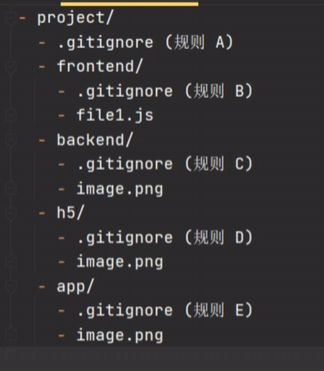

# 一些有用的知识

# gitignore的使用

https://www.bilibili.com/video/BV1fp4y1u7aK/?spm_id_from=333.337.search-card.all.click&vd_source=83e86f01de6b9a88af5641a22bd8ad7b

语法

若多个文件夹中都含有.gitignore文件，那么子文件夹的.gitignore文件会覆盖掉父文件夹的规则，并且只会影响该子文件夹及其孙以后文件夹的文件，就是说当前文件夹的.gitignore文件的规则只会对当前文件夹以及其所有子目录生效

