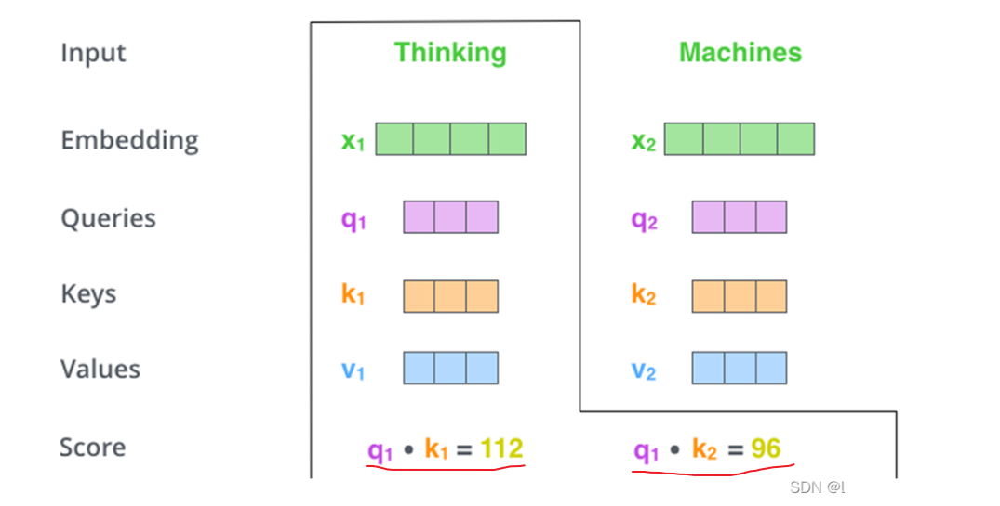
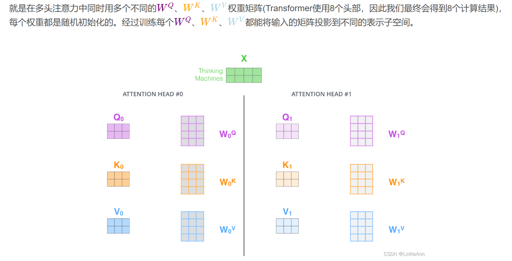
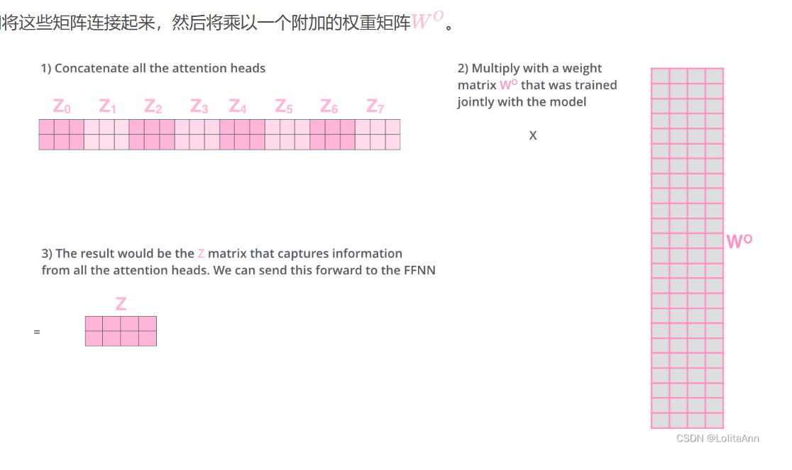
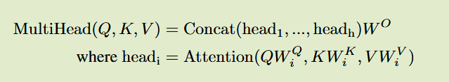
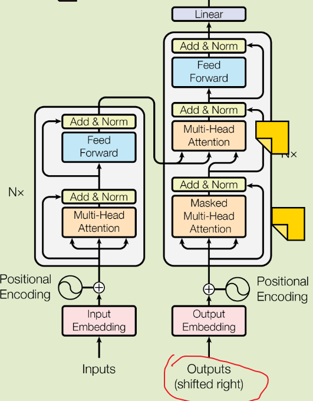
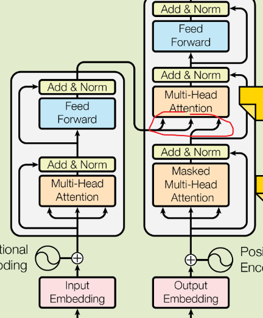

#  **The Illustrated Transformer（最直观的图解）**

文章地址：https://jalammar.github.io/illustrated-transformer/

中译版：https://blog.csdn.net/qq_36667170/article/details/124359818

embedding步骤把输入的每个单词通过词嵌入（embedding）转化为对应的向量。一个词可以用一个长度为512的向量表示，那么一句话就能表示为一个矩阵X，X的每一行都是一个词

编码器部分

多头注意力的思路：

相同的X乘以8组不同的Wq Wk Wv得到8组不同的QKV，然后对每一组分别进行attention计算，这样得到的八个输出即为8个head，此为一个多头注意力

Transformer中的一个多头注意力（有8个head）的计算，就相当于用自注意力做8次不同的计算，并得到8个不同的结果Z

最后把8个Z压缩成一个矩阵

[位置编码详解](https://lolitasian.blog.csdn.net/article/details/124336971)

解码器部分

解码器每一步的输出都会在下一个时间步喂给给**底部解码器**，解码器会像编码器一样运算并输出结果（每次往外蹦一个词）。

“encoder-decoder attention”层的工作原理和前边的多头自注意力差不多，但是Q、K、V的来源不同，Q是从下层创建的（比如解码器的输入和下层decoder组件的输出），但是其K和V是来自编码器最后一个组件的输出结果

线性层和softmax层

线性层就是一个简单的全连接神经网络，它将解码器生成的向量映射到logits向量中，**logits** 是指在模型的最后一层（通常是全连接层）的原始输出值，尚未经过归一化处理

softmax层将这些分数转化为概率（全部为正值，加起来等于1.0），选择其中概率最大的位置的词汇作为当前时间步的输出。

疑问：对于编码器， “query”、“key”、“value” 向量都是由相同的输入乘以不同的权重矩阵W而来，而权重矩阵W是通过训练不断更新的，那么这三个向量的作用和含义怎么理解？QKV是注意力机制的核心，就是它们完成了感兴趣词汇的提取

# 李宏毅：生成式 AI 时代下的机器学习

